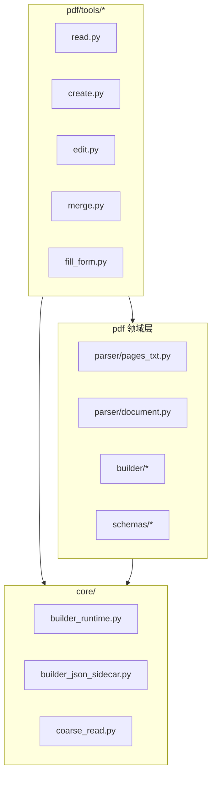
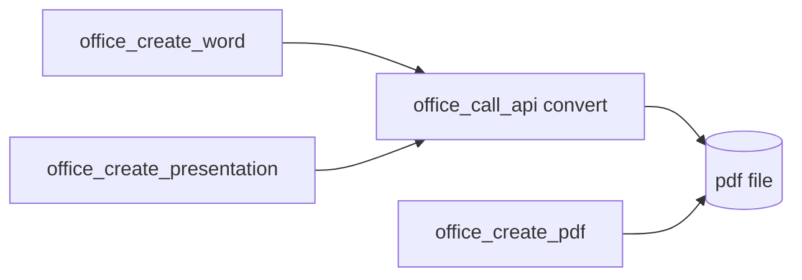

# Office MCP PDF Upgrade

让 LLM 对 **PDF 类**文档（重点：`.pdf`；兼读 `djvu` / `xps` / `oxps`）进行**精细化创建**与**精细化修改**的升级设计。

> **状态**：**已实现**（M6）；M7 文档同步  
> **范围**：`aiecs/tools/office_tool/pdf/`（新架构垂直模块）  
> **依赖**：ONLYOFFICE DocumentServer Document Builder + Conversion API；`core/` 公共层  
> **关联**：[OFFICE_TOOL_ARCHITECTURE_REORG.md](./OFFICE_TOOL_ARCHITECTURE_REORG.md)、[OFFICE_MCP_PDF_IMPLEMENTATION_DESIGN.md](./OFFICE_MCP_PDF_IMPLEMENTATION_DESIGN.md)（实现设计）、[OFFICE_MCP_PDF_LLM_GUIDE.md](./OFFICE_MCP_PDF_LLM_GUIDE.md)

本升级是架构重组 **M6 阶段**的 pdf 垂直交付。PDF 能力与 Word 不同：**原生 PDF 编辑面较窄**；「创建」分 **原生 PDF 构建** 与 **自 Word/PPT 转换** 两条路径。

---

## 1. 背景与目标

### 1.1 问题

当前 Office MCP 对 PDF **几乎无专用能力**：

| 能力 | 现状 | 问题 |
|------|------|------|
| **读取** | `office_read_document` → Conversion → **txt** | 无可靠 `page_index`；无块/表单域结构 |
| **创建** | 间接：`office_call_api` 将 docx/pptx convert 为 pdf | 无声明式「从零写 PDF」；LLM 路径不直观 |
| **编辑** | 无 | 无法「在第 2 页加一段」「填 AcroForm」 |
| **合并** | 无 | 无法 append 多个 pdf |
| **读→改闭环** | **不可用** | txt 无页界 |

### 1.2 目标（Must Have）

1. **精细化读取**（`office_read_pdf`）：`pages[]`（`page_index`、文本块、可选 form_fields）；定位符 **`page_index` + `block_index`**。
2. **精细化创建**（`office_create_pdf`）：声明式 `pages[]` / `blocks[]` → `.pdf`（Builder PDF API 或 docx→pdf 回退）。
3. **精细化编辑**（`office_edit_pdf`）：声明式 `operations[]`（增删页、插文本、注释、表单填充等 **DS 支持范围内**）。
4. **合并**（`office_merge_pdfs`）：按顺序拼接 PDF。
5. **表单填充**（`office_fill_pdf_form`）：AcroForm 字段名 → 值（与 Word 模板占位符区分）。
6. **格式**：主目标 **`.pdf`**；`core/categories.py` 中 `PDF_EXTENSIONS` 可读（`djvu`/`xps`/`oxps` 视 Conversion 支持）。
7. **架构**：`pdf/{parser,builder,schemas,tools}/` + `core/` + `registry.py`。
8. **向后兼容**：`legacy/read_document` 对 pdf 仍 txt 粗读。

### 1.3 非目标（Out of Scope v1）

- 全功能 PDF 版式引擎（任意坐标排版、路径绘制）
- 扫描件 OCR（本 MCP 不做 OCR）
- 数字签名 / 加密 / 权限位精细控制
- 复杂 redaction 工作流（v1 仅简单注释/涂黑类 op 若 DS 支持）
- **Rich 版式报告**首选路径仍是 `office_create_word` → `office_call_api` convert

### 1.4 能力边界（务实）

| 需求 | 推荐路径 |
|------|----------|
| 多页文字报告、表格 | `office_create_word` → convert pdf |
| 演示稿 PDF | `office_create_presentation` → convert pdf |
| 简单 PDF（几页居中文字、表单） | **`office_create_pdf`** |
| 合并合同扫描件 | **`office_merge_pdfs`** |
| 填已有 PDF 表单 | **`office_fill_pdf_form`** / **`office_edit_pdf`** |

ONLYOFFICE [PDF API](https://api.onlyoffice.com/docs/office-api/usage-api/pdf-api/)（Docs 9.3+）支持 `OpenFile(pdf)`、按页 `GetElement(i)`、段落/表格/注释/表单域；创建可走 `CreateFile("pdf")` 或 **docx 内容 + `SaveFile("pdf")`**（官方文档两种表述并存，实现需 E2E 探测 DS 版本）。

---

## 2. 在新架构中的位置

### 2.1 分层



### 2.2 双轨读取

| 模式 | 路径 | 用途 |
|------|------|------|
| **structured（默认）** | Builder `OpenFile(pdf)` → 逐页提取文本/表单 → sidecar JSON | 编辑定位 |
| **coarse** | Conversion → txt → `parser/pages_txt.py` 按页分割 | 快速预览；legacy 等价 |
| **outline** | 每页首行或标题启发式 | 目录式浏览 |

### 2.3 工具矩阵

| MCP 工具名 | 代码位置 | 说明 |
|------------|----------|------|
| `office_read_pdf` | `pdf/tools/read.py` | 结构化读取 |
| `office_create_pdf` | `pdf/tools/create.py` | 声明式创建 |
| `office_edit_pdf` | `pdf/tools/edit.py` | 声明式 operations |
| `office_merge_pdfs` | `pdf/tools/merge.py` | 合并 PDF |
| `office_fill_pdf_form` | `pdf/tools/fill_form.py` | AcroForm 批量填值 |
| `office_read_document` | `legacy/` | pdf → txt 粗读 |
| `office_call_api` | `gateway/` | docx/pptx→pdf 转换 |
| `office_execute_builder` | `gateway/` | 高级 PDF API 脚本 |

**无** `office_apply_template_pdf`：PDF 用 **`office_fill_pdf_form`**（字段名）而非 `{{key}}` 全文替换。

### 2.4 统一 read schema

`units[]` 为 canonical；`pages[]` 与其 **同内容**（见架构 §4）。

```json
{
  "category": "pdf",
  "title": "Contract Draft",
  "unit_count": 5,
  "page_count": 5,
  "units": [
    {
      "page_index": 0,
      "blocks": [
        { "block_index": 0, "type": "paragraph", "text": "Agreement" },
        { "block_index": 1, "type": "paragraph", "text": "Party A ..." }
      ],
      "form_fields": [
        { "name": "SignDate", "type": "text", "value": "" }
      ]
    }
  ],
  "pages": "<与 units[] 相同内容>",
  "read_mode": "fine",
  "_locator_note": "Use page_index and block_index with office_edit_pdf.",
  "_note": "For rich reports, prefer create_word + convert."
}
```

---

## 3. 支持格式

`core/categories.py` → `PDF_EXTENSIONS`：

```
pdf, djvu, xps, oxps
```

| 扩展名 | 读取 | 创建/编辑 | 说明 |
|--------|------|-----------|------|
| **`.pdf`** | ✅ 主格式 | ✅ | OpenFile / SaveFile `"pdf"` |
| **`.djvu` / `.xps` / `.oxps`** | Conversion txt（若 DS 支持） | ❌ v1 | 仅 read coarse |

---

## 4. 工具规格

### 4.1 `office_read_pdf`

**代码**：`pdf/tools/read.py` → `pdf/parser/document.py` + sidecar；coarse → `parser/pages_txt.py`

#### 参数

| 参数 | 类型 | 说明 |
|------|------|------|
| `source_path` / `source_url` | 二选一 | 源文件 |
| `format` | `structured` \| `outline` \| `text` | 默认 structured |
| `options.read_mode` | `fine` \| `coarse` | 默认 fine |
| `options.page_range` | `[int,int]` | inclusive `page_index` |
| `options.include_form_fields` | bool | 默认 true（structured） |
| `options.include_annotations` | bool | 默认 false（v1） |

#### 精读 sidecar（示意）

```javascript
builder.OpenFile(url, "pdf");
var doc = Api.GetDocument();
var out = { pages: [] };
for (var i = 0; i < doc.GetElementsCount(); i++) {
  var page = doc.GetElement(i);
  // 遍历 page 上 paragraph 取 text；枚举 form fields
  out.pages.push({ page_index: i, blocks: [...], form_fields: [...] });
}
// JSON → sidecar txt
builder.CloseFile();
```

Coarse：Conversion `outputtype=txt`，Python **`parser/pages_txt.py`** 分页（**ADR-020** 优先级）：`\f` → 行匹配 `--- page N ---` → 否则整份单页 + `_note`。

---

### 4.2 `office_create_pdf`

**代码**：`pdf/tools/create.py` → `pdf/builder/create.py`

#### 参数

| 参数 | 类型 | 必填 |
|------|------|------|
| `pages` | array | 是 |
| `output_path` | string | 是 |
| `options.page_size` | `A4` \| `Letter` | 否 |
| `options.create_mode` | `native` \| `via_docx` | 否，默认 `native`（**ADR-017**：**不**自动回退；native 失败 → `{isError}`，提示显式改 `via_docx` 重试） |

#### PageSpec / BlockSpec（v1）

```json
{
  "pages": [
    {
      "blocks": [
        {
          "type": "paragraph",
          "text": "Invoice #1024",
          "align": "center",
          "bold": true
        },
        {
          "type": "paragraph",
          "text": "Bill To: ACME Corp"
        },
        {
          "type": "table",
          "rows": [["Item", "Qty"], ["Service", "1"]]
        }
      ]
    },
    {
      "blocks": [
        { "type": "paragraph", "text": "Thank you." }
      ]
    }
  ]
}
```

**v1 block types**：`paragraph`、`table`；v2：`image`。

#### Builder（native，Docs 9.3+）

```javascript
builder.CreateFile("pdf");
var doc = Api.GetDocument();
var page = doc.GetElement(0);
var para = Api.CreateParagraph();
para.SetJc("center");
para.AddText("Invoice #1024");
page.Push(para);
builder.SaveFile("pdf", "output.pdf");
builder.CloseFile();
```

#### via_docx（显式模式）

与官方 PDF API 文档一致：`CreateFile("docx")` → 填内容 → `SaveFile("pdf", ...)`。调用方在 native 失败时 **显式** 设 `create_mode=via_docx` 重试（**ADR-017**）；runtime **不** silent 自动切换。

---

### 4.3 `office_edit_pdf`

**代码**：`pdf/tools/edit.py` → `pdf/builder/edit.py`

#### 参数

| 参数 | 类型 | 必填 | 说明 |
|------|------|------|------|
| `source_path` / `source_url` | string | 二选一 | 源文件 |
| `output_path` | string | 是 | 输出路径 |
| `operations` | array | 是 | `pdf/schemas/edit_ops.py` |
| `options.backup` | bool | 否 | object storage 备份（与 word 一致） |

#### Operation 类型（v1）

| op | 字段 | 说明 |
|----|------|------|
| `add_paragraph` | `page_index`, `text`, `align?` | 页末或指定页追加段落 |
| `set_page_text` | `page_index`, `blocks[]` | **替换**该页内容（慎用） |
| `add_page` | `after_index`, `blocks[]?` | 插入空白页或带内容 |
| `delete_page` | `page_index` | 删页 |
| `rotate_page` | `page_index`, `degrees` | 90/180/270（若 DS 支持） |
| `add_annotation` | `page_index`, `kind`, `text`, `rect?` | `freetext` / `highlight`（v1 子集） |

**v1 不含** `fill_form_field`（**ADR-030**）：所有 AcroForm 填写 → **`office_fill_pdf_form`**。

**v1 不含** `append_pdf_pages`：从另一 PDF 并入页请用 **`office_merge_pdfs`**（多文件顺序合并）或在 `office_edit_pdf` 中通过 `add_page` 实现单页插入。

示例：

```json
{
  "source_path": "gs://bucket/contract.pdf",
  "output_path": "gs://bucket/contract-signed.pdf",
  "operations": [
    {
      "op": "add_paragraph",
      "page_index": 4,
      "text": "Signed electronically on 2026-06-21.",
      "align": "left"
    }
  ]
}
```

表单填写见 **`office_fill_pdf_form`**（**ADR-030**），勿在 `edit_pdf` operations 中填表。

---

### 4.4 `office_merge_pdfs`

**代码**：`pdf/tools/merge.py`

参数：`source_paths` / `source_urls`（有序）、`output_path`、`options.engine`（可选，`builder` \| `conversion`，默认 **`builder`**）。

实现（**ADR-018**）：

1. **Builder**（默认）：`CreateFile("pdf")` 或 OpenFile 第一个 → 依次 OpenFile 后续 → 复制/Insert 页（以 DS 样本为准）。
2. **Conversion**（显式 `options.engine=conversion`）：Conversion 链合并；可能丢表单/注释；**不** silent 自动切换；tool description 须说明限制。

E2E：覆盖 builder 默认路径 + conversion 显式路径。

---

### 4.5 `office_fill_pdf_form`

**代码**：`pdf/tools/fill_form.py`

| 参数 | 说明 |
|------|------|
| `source_path` / `source_url` | 含表单域的 PDF |
| `data` | `{ "FieldName": "value", ... }` |
| `output_path` | 输出 PDF |

实现（**ADR-019**）：`OpenFile` → **逐字段** widget `SetValue`（字段名须与 `read_pdf` 的 `form_fields[].name` 一致）→ `SaveFile`。**不**使用 `SetFormsData` 批量接口。

与 `office_edit_pdf` 关系（**ADR-030**）：**所有**表单填写（单字段或多字段）**仅**用 `office_fill_pdf_form`；`edit_pdf` **无** `fill_form_field` op。

---

## 5. 目录清单

```
aiecs/tools/office_tool/pdf/
├── parser/
│   ├── pages_txt.py              # Conversion txt → pages[]
│   └── document.py               # sidecar JSON → pages[] / blocks[]
├── builder/
│   ├── create.py
│   ├── edit.py
│   ├── merge.py
│   └── fill_form.py
├── schemas/
│   ├── read.py
│   ├── page_spec.py
│   └── edit_ops.py
└── tools/
    ├── read.py
    ├── create.py
    ├── edit.py
    ├── merge.py
    └── fill_form.py
```

```
tests/office_mcp/pdf/
├── test_pages_txt_parser.py
├── test_read_pdf.py
├── test_create_pdf.py
├── test_edit_pdf.py
├── test_merge_pdfs.py
├── test_fill_pdf_form.py
└── test_e2e_pdf_tools.py         # @pytest.mark.pdf @pytest.mark.e2e
```

---

## 6. 测试策略

### E2E 用例

1. `create_pdf` 2 页 → `read_pdf` 断言 `page_count`
2. `edit_pdf` add_paragraph → read 验证
3. `merge_pdfs` 两个 1-page pdf → 2 pages
4. `fill_pdf_form` 模板 pdf（含文本域）
5. `create_mode=native` 与显式 `via_docx` 各测一次（**不**测 auto fallback；视 DS 版本 skip native）
6. `merge_pdfs` builder 默认 + `options.engine=conversion` 显式路径
6. legacy `read_document` pdf→txt 不变

---

## 7. 实施计划（M6）

**实现细节**（文件级 API、Pydantic schema、sidecar/Builder 模板、PR 分解、测试 checklist）见 **[OFFICE_MCP_PDF_IMPLEMENTATION_DESIGN.md](./OFFICE_MCP_PDF_IMPLEMENTATION_DESIGN.md)**。

| 阶段 | 交付 | 验证 |
|------|------|------|
| **M6-P0** | `parser/pages_txt.py` + `office_read_pdf` coarse | 单元 |
| **M6-P1** | fine read + sidecar | E2E read |
| **M6-P2** | `office_merge_pdfs` | E2E merge |
| **M6-P3** | `office_create_pdf` + `office_edit_pdf` core ops | E2E |
| **M6-P4** | `office_fill_pdf_form` + registry | E2E 表单 |
| **M6-P5** | LLM 指南、README、DS 版本说明 | 文档 |

**前置**：M0–M1；可与 M5 spreadsheet 并行。

### 7.1 实施状态（M7 · Gate G5）

| 阶段 | 状态 | 代码位置 |
|------|------|----------|
| M6 P0–P4 | ✅ | `pdf/` 五工具（无 apply_template） |
| M6 registry 终态 | ✅ | 23 canonical / 27 handlers |
| M7 文档 | ✅ | 本表 + [LLM 指南](./OFFICE_MCP_PDF_LLM_GUIDE.md) |

---

## 8. 向后兼容

| 项目 | 策略 |
|------|------|
| `office_read_document` + pdf | txt 粗读保留 |
| 从 docx 生成 pdf | 继续 `office_call_api` convert；在 read_pdf `_note` 中说明 |

---

## 9. 风险与缓解

| 风险 | 缓解 |
|------|------|
| DS 版本 PDF API 差异 | E2E 探针 skip native；runtime 失败 `{isError}` + 提示显式 `create_mode=via_docx`（**ADR-017**） |
| 扫描 PDF 几乎无文本 | read 返回空 blocks + 提示 OCR 非本工具范围 |
| 合并 API 不稳定 | 默认 Builder；显式 `options.engine=conversion`（**ADR-018**） |
| LLM 误用 create_pdf 写长报告 | LLM 指南 + `_note` 指向 word→convert |

---

## 10. 参考

- [OFFICE_MCP_PDF_IMPLEMENTATION_DESIGN.md](./OFFICE_MCP_PDF_IMPLEMENTATION_DESIGN.md) — M6 P0–P5 可执行实现设计
- [implementation_design.md](./implementation_design.md) §7.4 — 全局 M6 任务
- [OFFICE_TOOL_ARCHITECTURE_REORG.md](./OFFICE_TOOL_ARCHITECTURE_REORG.md) §7.4
- [ONLYOFFICE PDF API](https://api.onlyoffice.com/docs/office-api/usage-api/pdf-api/)
- [Document Builder overview](https://api.onlyoffice.com/docs/document-builder/get-started/overview/)

---

## 附录 A：与其他类别「创建 PDF」的关系



LLM 应优先：**版式复杂 → word/presentation + convert**；**简单页/表单 → create_pdf**。
