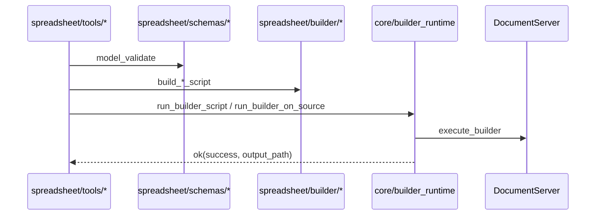
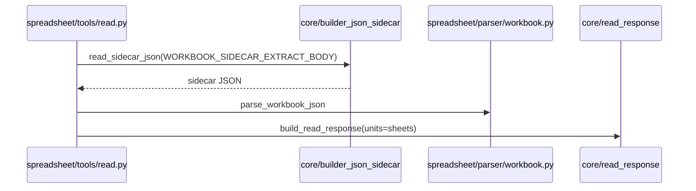

# Office MCP Spreadsheet — Implementation Design

Spreadsheet 垂直模块的**独立实现设计**：在 [OFFICE_MCP_SPREADSHEET_UPGRADE.md](./OFFICE_MCP_SPREADSHEET_UPGRADE.md)（What/LLM 规格）与 [implementation_design.md](./implementation_design.md)（全局 How）基础上，描述 **M5 S0–S4 + M6 注册** 的**已实现**代码结构、Core 集成、Schema/Parser/Builder API、Registry 暴露与验收标准。

> **状态**：**Implemented**（M5 架构 + unit ✅；**ST-037–057、ST-DOC-04** ✅）  
> **读者**：维护工程师、Reviewers、E2E 维护者  
> **规格源**：[OFFICE_MCP_SPREADSHEET_UPGRADE.md](./OFFICE_MCP_SPREADSHEET_UPGRADE.md)  
> **LLM 调用**：[OFFICE_MCP_SPREADSHEET_LLM_GUIDE.md](./OFFICE_MCP_SPREADSHEET_LLM_GUIDE.md)（字段名以本文 §14 为准）  
> **架构约束**：[OFFICE_TOOL_ARCHITECTURE_REORG.md](./OFFICE_TOOL_ARCHITECTURE_REORG.md) §2、§7.3

---

## 1. 文档关系

| 文档 | 角色 |
|------|------|
| [OFFICE_MCP_SPREADSHEET_UPGRADE.md](./OFFICE_MCP_SPREADSHEET_UPGRADE.md) | **What**：工具参数、sheets schema、operations 语义、LLM 工作流 |
| **本文档** | **How（Spreadsheet 局部）**：目录树、已实现 API、Builder 映射、测试与 Gate |
| [implementation_design.md](./implementation_design.md) | **How（全局）**：Core §4、Registry §5、统一 read §6、M5 §7.3 |
| [OFFICE_TOOL_IMPLEMENTATION_TASKS_BY_FILE.md](./OFFICE_TOOL_IMPLEMENTATION_TASKS_BY_FILE.md) | 全局 OT-100–112（M5） |
| [OFFICE_MCP_SPREADSHEET_IMPLEMENTATION_TASKS_BY_FILE.md](./OFFICE_MCP_SPREADSHEET_IMPLEMENTATION_TASKS_BY_FILE.md) | **按文件任务** ST-001–057 |
| [AI_PROMPT_OFFICE_MCP_SPREADSHEET_IMPLEMENTATION.md](./AI_PROMPT_OFFICE_MCP_SPREADSHEET_IMPLEMENTATION.md) | **Agent 执行序**（ST-037–057 收尾 Batch prompt） |
| [OFFICE_MCP_SPREADSHEET_LLM_GUIDE.md](./OFFICE_MCP_SPREADSHEET_LLM_GUIDE.md) | LLM 调用示例 |
| [ADR.md](./ADR.md) | Spreadsheet 相关已采纳决策（§2；收尾 **ADR-031–040**） |

**分工**：UPGRADE = 产品/LLM 规格；**本文档** = 代码真源与维护手册；`implementation_design.md` = 四类垂直总表。

---

## 2. 目标与成功标准

### 2.1 Spreadsheet 模块目标

1. **五 canonical 工具**：`office_read_spreadsheet`、`office_create_spreadsheet`、`office_edit_spreadsheet`、`office_merge_spreadsheets`、`office_apply_template_spreadsheet`。
2. **读→改闭环**：`office_read_spreadsheet`（fine sidecar 多 sheet）→ `office_edit_spreadsheet`（`sheet_name`/`sheet_index` + A1）→ re-read 验证。
3. **格式**：`.xlsx` / `.ods` / `.xls` 及 `core/categories.SPREADSHEET_EXTENSIONS`；`SaveFile` / `CreateFile` 跟 `output_path` 扩展名。
4. **架构**：`spreadsheet/` 仅依赖 `core/`；不 import 其他 vertical；handler 经 `registry.py` 注册。
5. **兼容**：**无 spreadsheet legacy 别名**（**ADR-024**）；`office_read_document` 对 xlsx/xls/ods 的 **csv 粗读**行为冻结。

### 2.2 Release Gates（Spreadsheet 子集）

> **状态（2026-06）**：S0–S4 代码与 unit 测试已落地；**S-E2E** ✅（ST-042）；**ADR-031–040** 代码与 Builder 收尾 ✅（ST-043–057）。

| Gate | 条件 | 状态 |
|------|------|------|
| **S0** | `spreadsheet/` 树 + `parser/csv.py` + read coarse；legacy xlsx csv 回归 | ✅ |
| **S1** | fine read sidecar + `parser/workbook.py`；`sheets[]` ≡ `units[]` | ✅ unit；E2E ✅（ADR-021 能力探针 skip） |
| **S2** | `office_create_spreadsheet` xlsx/ods 脚本 + unit | ✅ unit；E2E ✅（ADR-021 能力探针 skip） |
| **S3** | edit：`set_cell` / `set_range` / `add_sheet` 等 10 op | ✅ unit；E2E ✅（ADR-021 能力探针 skip） |
| **S4** | merge + template + registry 五工具；`[Spreadsheet]` 前缀 | ✅（merge rename **ADR-038**；template dedup **ADR-039**） |
| **M5** | registry **18/22**（含 spreadsheet×5） | ✅ |
| **M6** | registry 终态 **23/27** | ✅ |
| **S-E2E** | DS 自动化 E2E（`test_e2e_spreadsheet_tools.py`） | ✅ |

### 2.3 非目标（v1 未实现 / 不在范围）

- Pivot 表、图表、条件格式、宏/VBA
- `office_edit_spreadsheet` 之外的 Builder 裸脚本工具（用 `office_execute_builder`）
- Spreadsheet legacy MCP 别名（无 `office_merge_spreadsheets` → 旧名）
- 从 `list_tools` 移除 legacy 名（全局 **ADR-024** breaking PR）

---

## 2.4 已采纳 ADR（Spreadsheet 实现必须遵守）

| ADR | 决策 | 实现落点 |
|-----|------|----------|
| **ADR-002** | MCP 参数用 Pydantic v2 | `spreadsheet/schemas/*` |
| **ADR-006** | 统一 `{isError}` / `{success}` | 全部 handler 经 `core/errors.py` |
| **ADR-013** | sidecar 用 **`GetSheetsCount()` + for** | `parser/workbook.py` `WORKBOOK_SIDECAR_EXTRACT_BODY` |
| **ADR-014** | 模板：显式 `Sheet!A1` 优先；`{{key}}` 仅 **used_range** 内 Search | `builder/template.py` |
| **ADR-015** | 对外 **`cell` / `range`（A1）**；无 `row`/`col` | `edit_ops.py`；builder 内部 `parse_a1` 0-based |
| **ADR-021** | DS 能力探针；无 `GetSheetsCount` → fine E2E skip | `tests/office_mcp/probe_ds_capabilities.py` |
| **ADR-024** | `list_tools` 仅 canonical；spreadsheet **无 legacy 别名** | 五工具仅 canonical |
| **ADR-025** | description 前缀 `[Spreadsheet]` | 五个 canonical spreadsheet 工具 |
| **ADR-028** | `build_read_response` M1 blocking | `spreadsheet/tools/read.py` |
| **ADR-029** | M3 后 core 严格 freeze | 新需求不得改 core 行为 |
| **ADR-031** | fine read `include_formulas` | sidecar GetFormula 分支（ST-043） |
| **ADR-032** | v1 **无** `default_col_width` | 从 schema/TOOL_DEF 移除（ST-045） |
| **ADR-033** | read **`headers=rows[0]`**；create `header_row` 纯语义 | `parse_workbook_json`（ST-046） |
| **ADR-034** | read `options.range` 裁剪 | 先 range 后 max_rows（ST-044） |
| **ADR-035** | `copy_sheet` + 可选 `new_name` | `edit_ops` / `builder/edit.py`（ST-049） |
| **ADR-036** | `add_sheet` **无** 初始 `rows` | Pydantic 拒绝多余 `rows`（ST-055） |
| **ADR-037** | `insert_rows` 可选 `values`；`set_range` 仅 range+values | `builder/edit.py`（ST-056） |
| **ADR-038** | merge `_2`/`_3` 后缀；false→isError | `builder/merge.py`（ST-048） |
| **ADR-039** | template builder dedup | 落实 ADR-014（ST-050） |
| **ADR-040** | edit op 字段 canonical | `sheet_name`/`new_name` 等（ST-047） |

---

## 3. 已实现代码结构

### 3.1 目录树（Canonical）

```
aiecs/tools/office_tool/spreadsheet/
├── __init__.py
├── parser/
│   ├── __init__.py
│   ├── csv.py                 # re-export core/coarse_parsers/csv
│   └── workbook.py            # sidecar JSON → sheets[]；parse_a1/range
├── builder/
│   ├── __init__.py
│   ├── create.py              # build_create_script
│   ├── edit.py                # build_edit_script（10 op）
│   ├── merge.py               # build_merge_script
│   └── template.py            # build_template_script（ADR-014）
├── schemas/
│   ├── __init__.py
│   ├── read.py                # SpreadsheetReadArgs
│   ├── workbook_spec.py       # SheetSpec + create args
│   └── edit_ops.py            # EditOperation + merge/template args
└── tools/
    ├── read.py                # office_read_spreadsheet
    ├── create.py              # office_create_spreadsheet
    ├── edit.py                # office_edit_spreadsheet
    ├── merge.py               # office_merge_spreadsheets
    └── template.py            # office_apply_template_spreadsheet
```

### 3.2 依赖规则（已实现）

```
spreadsheet/tools/*     → spreadsheet/builder/*, schemas/*, parser/*, core/*
spreadsheet/builder/*   → core/builder_js, core/categories（不 import tools）
spreadsheet/parser/*    → stdlib；csv.py → core/coarse_parsers/csv
spreadsheet/*           ↛ word | presentation | pdf
core/*                  ↛ spreadsheet（ADR-029 freeze）
```

### 3.3 工具矩阵

| MCP 工具名 | 模块 | Registry | Legacy |
|------------|------|----------|--------|
| `office_read_spreadsheet` | `spreadsheet/tools/read.py` | canonical | — |
| `office_create_spreadsheet` | `spreadsheet/tools/create.py` | canonical | — |
| `office_edit_spreadsheet` | `spreadsheet/tools/edit.py` | canonical | — |
| `office_merge_spreadsheets` | `spreadsheet/tools/merge.py` | canonical | — |
| `office_apply_template_spreadsheet` | `spreadsheet/tools/template.py` | canonical | — |
| `office_read_document` | `legacy/read_document.py` | — | call_tool；xlsx/xls/ods → csv 粗读 |

每个 canonical 模块导出：`TOOL_NAME`, `TOOL_DEF`, `handler`。Description 前缀 **`[Spreadsheet]`**（**ADR-025**）。

---

## 4. Core 层集成

Spreadsheet 模块**不重复实现**下列 Core API（见 `implementation_design.md` §4）：

| Core 模块 | Spreadsheet 用途 |
|-----------|------------------|
| `core/categories.py` | `assert_category_path("spreadsheet", path)`；`builder_file_ext(output_path)`；`llm_coarse_output_type` |
| `core/errors.py` | 全部 handler 返回 `err()` / `ok()`（**ADR-006**） |
| `core/read_response.py` | `office_read_spreadsheet` 结构化响应（**ADR-028**）；mirror `sheets[]` |
| `core/builder_json_sidecar.py` | fine read：`read_sidecar_json(..., WORKBOOK_SIDECAR_EXTRACT_BODY)` |
| `core/coarse_read.py` | `convert_and_fetch`（coarse / `read_mode=coarse`） |
| `core/coarse_parsers/csv.py` | csv 粗读结构（经 `parser/csv.py` re-export） |
| `core/source.py` | `resolve_document_source` |
| `core/builder_runtime.py` | `run_builder_script`（create/merge）；`run_builder_on_source`（edit/template） |
| `core/builder_js.py` | `escape_js`, `open_file`, `save_file`, `close_file` |
| `core/storage/*` | upload、backup、`ACCEPTED_SOURCE_PATH_FORMATS` |

### 4.1 统一 read 响应（Spreadsheet）

`build_read_response(category="spreadsheet", units=sheets, ...)` 产出：

| 字段 | 说明 |
|------|------|
| `category` | `"spreadsheet"` |
| `units` / `sheets` | **同内容** mirror（`read_response._CATEGORY_ALIASES`） |
| `unit_count` | `len(sheets)` |
| `read_mode` | `"fine"` \| `"coarse"` |
| `_locator_note` | 固定文案，指向 `office_edit_spreadsheet` + A1 |
| `source_path` / `source_path_format` | 存储路径 |
| `extra` | 如 `conversion_output_type`, `_truncated`, `_note`（coarse 单 sheet 警告） |

`format=text` 时返回 `ok(text=...)`，不走 `build_read_response`。

**`_locator_note`（as-built）**：

```
Edit with office_edit_spreadsheet using sheet_name or sheet_index + cell (A1) or range.
Do not use office_read_document row index.
```

---

## 5. Pydantic Schemas（ADR-002 / ADR-015）

路径：`spreadsheet/schemas/`。Handler 入口统一 `Model.model_validate(raw)`。

### 5.1 `schemas/read.py`

```python
class SpreadsheetReadOptions(BaseModel):
    read_mode: Literal["fine", "coarse"] = "fine"
    sheet_names: list[str] | None = None
    max_rows: int | None = Field(default=None, ge=1)
    include_formulas: bool = False      # ADR-031；handler 待 ST-043
    range: str | None = None            # ADR-034；handler 待 ST-044

class SpreadsheetReadArgs(BaseModel):
    source_path: str | None = None
    source_url: str | None = None
    format: Literal["structured", "outline", "text"] = "structured"
    options: SpreadsheetReadOptions = Field(default_factory=SpreadsheetReadOptions)
    # validator: source_path XOR source_url；至少其一
```

### 5.2 `schemas/workbook_spec.py`

```python
class SheetSpec(BaseModel):
    name: str = Field(min_length=1, max_length=31)
    rows: list[list[Any]] = Field(min_length=1)
    header_row: bool = False            # ADR-033：纯 LLM 语义；不改变 Builder

class SpreadsheetCreateArgs(BaseModel):
    sheets: list[SheetSpec] = Field(min_length=1)
    output_path: str
    # ADR-032：v1 无 SpreadsheetCreateOptions / default_col_width
```

### 5.3 `schemas/edit_ops.py`

**Op 枚举（v1 as-built）**：

```python
OpName = Literal[
    "set_cell", "set_range", "clear_range",
    "insert_rows", "delete_rows",
    "add_sheet", "delete_sheet", "rename_sheet",
    "set_formula", "copy_sheet",
]
```

**Sheet 定位**：`sheet_index`（0-based）与 `sheet_name` 均在 `EditOperation` 上；**未强制 XOR**——缺省时 builder 用 `Api.GetActiveSheet()`。

| op | 必填字段（Pydantic validator） | LLM 面向 |
|----|-------------------------------|----------|
| `set_cell` | `cell`, `value` | A1 + 值 |
| `set_range` | `range`, `values` | 区域 + 二维数组；**无** anchor 备选（**ST-057**） |
| `clear_range` | `range` | — |
| `set_formula` | `cell`, `formula` | 如 `"=SUM(A1:A10)"` |
| `insert_rows` | `at_row`（**1-based**）, `count` | Excel 行号；**无**插行后 `values`（**ST-056**） |
| `delete_rows` | `from_row`（1-based）, `count` | — |
| `add_sheet` | `name` | 新 sheet 名；**无**初始 `rows`（**ST-055**） |
| `delete_sheet` | `sheet_index` 或 `sheet_name` | — |
| `rename_sheet` | `sheet_name`, **`new_name`** | 非 `name`（**ADR-040**） |
| `copy_sheet` | `sheet_index` 或 `sheet_name` | 可选 **`new_name`**（**ADR-035**） |

**ADR-015**：`no_row_col` validator 拒绝 model 内 `row`/`col` 字段（extras 仍可能被 Pydantic 忽略）。

```python
class SpreadsheetEditArgs(BaseModel):
    source_path | source_url, output_path, operations[], options.backup

class SpreadsheetMergeArgs(BaseModel):
    source_paths XOR source_urls, output_path, options.rename_conflicts

class SpreadsheetTemplateArgs(BaseModel):
    template_path XOR template_url, data: dict, output_path
```

---

## 6. Parser 层

### 6.1 `parser/csv.py`

Re-export（实现位于 `core/coarse_parsers/csv.py`）：

```python
def parse_csv_to_structure(text: str) -> dict       # legacy elements[] 形状
def extract_outline_from_csv(text: str) -> list[dict]
def csv_to_coarse_sheets(text: str) -> list[dict]   # 单 sheet Sheet1 快照
```

粗读 `_note`：`Coarse csv read may expose only the first sheet — re-read with read_mode=fine before multi-sheet edit.`

### 6.2 `parser/workbook.py`

**Sidecar extract（ADR-013）** — `WORKBOOK_SIDECAR_EXTRACT_BODY`：

- `Api.GetSheetsCount()` 循环
- 每 sheet：`GetUsedRange()` → 逐格 `GetValue(r,c)` → `rows[][]`
- 输出 `{sheets:[{sheet_index, name, rows, used_range?, row_count, col_count}]}`

**空 sheet 行为（ST-054）**：sidecar 中 `used` 为 null 时，parser 输出 `{rows:[]}` 且 **省略** `used_range` 键（非 `used_range:null`）。`include_formulas`（**ADR-031** / **ST-043**）已实现。

**公共 API**：

```python
def parse_workbook_json(raw: dict | str) -> list[dict]: ...
def filter_sheet_names(sheets, names: list[str] | None) -> list: ...
def apply_max_rows(sheets, max_rows) -> tuple[list, bool]: ...  # _truncated
def sheets_to_outline(sheets) -> list[dict]: ...
def sheets_to_text(sheets) -> str: ...
def parse_a1(cell: str) -> tuple[int, int]: ...       # A1 → 0-based
def parse_range(range_str: str) -> tuple[int,int,int,int]: ...
```

---

## 7. Builder 脚本生成

输出扩展名：**`builder_file_ext(output_path)`**（`xlsx` / `ods` / `xls`）。

### 7.1 `builder/create.py`

```python
def build_create_script(
    sheets: list[SheetSpec],
    *,
    output_ext: str,
) -> str:
```

| 步骤 | JS 要点 |
|------|---------|
| 首 sheet | `CreateFile(ext)` → `GetActiveSheet()` → `SetName` → `SetValue` 二维块 |
| 后续 sheet | `AddSheet()` / `GetSheet(i)` → 同上 |
| 结束 | `SaveFile(ext, "output.{ext}")` + `CloseFile` |

**ADR-032**：无 `default_col_width`。**ADR-033**：`header_row` 纯语义，不改变 Builder。

执行：`run_builder_script(script, output_path=...)`.

### 7.2 `builder/edit.py`

```python
def build_edit_script(operations: list[EditOperation], *, file_ext: str) -> str:
    """Body only — Open/Save 由 run_builder_on_source 注入。"""
```

| op | 实现策略（as-built） |
|----|----------------------|
| `set_cell` | `_emit_resolve_sheet` → `GetRange("B3").SetValue(...)` |
| `set_range` | `GetRange("A2:C2").SetValue(JSON values)` | **ADR-037**：仅 range+values |
| `clear_range` | `GetRange(...).Clear()` | — |
| `set_formula` | `GetRange(cell).SetFormula(...)` | — |
| `insert_rows` | `InsertRows` + 可选 `SetValue` | **ADR-037** → ST-056 |
| `delete_rows` | `DeleteRows(from_row-1, count)` | — |
| `add_sheet` | `Api.AddSheet(name)` | **ADR-036**：无初始 rows → ST-055 |
| `delete_sheet` | `ws.Delete()` |
| `rename_sheet` | `ws.SetName(new_name)` |
| `copy_sheet` | Copy API + 可选 `SetName(new_name)` | **ADR-035** ✅ ST-049 |

Sheet 解析：`GetSheetByName` / `GetSheet(index)` / 默认 `GetActiveSheet()`。

执行：`run_builder_on_source(..., backup_source_path=...)`.

### 7.3 `builder/merge.py`

```python
def build_merge_script(
    source_urls: list[str],
    source_exts: list[str],
    *,
    output_path: str,
    rename_conflicts: bool = True,
) -> str:
```

**已实现**：`CreateFile` → 逐源 `OpenFile` → 遍历 sheets → `Copy` 到目标工作簿 → `SaveFile`。

**ADR-038 目标**：`rename_conflicts=True` 时 `_2`/`_3` suffix；`false` → isError（✅ **ST-048**）。

### 7.4 `builder/template.py`（ADR-014）

```python
def split_sheet_ref(ref: str) -> tuple[str | None, str]: ...
def build_template_script(data: dict[str, Any], *, file_ext: str) -> str:
```

| 阶段 | 策略 |
|------|------|
| **显式地址** | `Summary!B2` 或 bare `A1` → `GetSheetByName` + `GetRange` + `SetValue` |
| **`{{key}}` 辅助** | 各 sheet `GetUsedRange().SearchAndReplace("{{key}}", value)` |

**ADR-039 目标**：显式地址 consumed keys 不再 Search（✅ **ST-050**）。

---

## 8. Tool Handlers

### 8.1 `office_read_spreadsheet`（`tools/read.py`）

```
SpreadsheetReadArgs validate
→ resolve_document_source → assert spreadsheet category
→ read_mode=fine:
    read_sidecar_json(WORKBOOK_SIDECAR_EXTRACT_BODY)
    parse_workbook_json → filter_sheet_names → apply_max_rows
    format=outline → sheets_to_outline
    format=text → ok(text=sheets_to_text)
    else build_read_response(units=sheets, read_mode=fine, locator_note=LOCATOR_NOTE)
→ read_mode=coarse:
    convert_and_fetch → csv_to_coarse_sheets → 同上 filters
    build_read_response(read_mode=coarse, extra._note=COARSE_NOTE)
```

### 8.2 `office_create_spreadsheet`

`SpreadsheetCreateArgs` → `build_create_script` → `run_builder_script`.

### 8.3 `office_edit_spreadsheet`

`SpreadsheetEditArgs` → `build_edit_script` → `run_builder_on_source`；可选 `copy_source_to_backup` when `options.backup=True`.

### 8.4 `office_merge_spreadsheets` / `office_apply_template_spreadsheet`

- **merge**：resolve 多源 signed URL → `build_merge_script` → `run_builder_script`
- **template**：resolve template → `build_template_script` → `run_builder_on_source`

### 8.5 与 Word / Presentation 的差异

| 维度 | Word | Presentation | Spreadsheet |
|------|------|--------------|-------------|
| 精读 | `doc.ToJSON` sidecar | `SlidesToJSON` sidecar | **无整表 ToJSON**；`GetSheetsCount` + `GetUsedRange` 遍历 |
| 粗读 | Conversion HTML | Conversion HTML | Conversion **csv**（单 sheet 局限） |
| 主定位 | `block_index`, `heading_path` | `slide_index`, `shape_index` | **`sheet_name` / `sheet_index` + A1 / `range`** |
| Legacy 别名 | merge/template/edit_script | 无 | **无**（仅 `read_document` csv） |

规格细节见 [UPGRADE §4.6](./OFFICE_MCP_SPREADSHEET_UPGRADE.md#46-与-wordpresentation-的差异)。

---

## 9. Registry 与 MCP 暴露

### 9.1 Canonical 注册

`registry.py` → `CANONICAL_MODULES`（Spreadsheet 段）：

```python
"aiecs.tools.office_tool.spreadsheet.tools.read",
"aiecs.tools.office_tool.spreadsheet.tools.create",
"aiecs.tools.office_tool.spreadsheet.tools.edit",
"aiecs.tools.office_tool.spreadsheet.tools.merge",
"aiecs.tools.office_tool.spreadsheet.tools.template",
```

| 里程碑 | `collect_office_tools()` 含 Spreadsheet | `get_handlers()` |
|--------|----------------------------------------|------------------|
| **M5** | gateway×2 + word×6 + pres×5 + **sheet×5 = 18** | **22**（+4 legacy） |
| **M6 终态** | **23** | **27** |

### 9.2 Legacy

**无 spreadsheet 专用 legacy 别名**。`office_read_document` 仍对 spreadsheet 扩展名走 Conversion csv（`legacy/read_document.py`）。

---

## 10. 数据流

### 10.1 写路径



### 10.2 读路径（Fine）



### 10.3 读路径（Coarse）

```
resolve_document_source
→ convert_and_fetch(llm_coarse_output_type → csv)
→ csv_to_coarse_sheets
→ build_read_response(read_mode=coarse, extra._note)
```

### 10.4 风险与缓解

| 风险 | 缓解 | 任务 |
|------|------|------|
| csv 粗读丢 sheet | fine read 默认；coarse `_note` | ST-NA-01 |
| 大表 sidecar 体积 | `max_rows`（已接线）；`options.range`（ST-044）；outline | ST-044 |
| xls 格式限制 | E2E 读取（ST-053）；新建推荐 xlsx/ods | ST-053 |
| 公式 vs 值 | `include_formulas`（ST-043）；edit 用 `set_formula` | ST-043 |
| GetSheetsCount 不可用 | ADR-021 fine E2E skip；coarse 仍可用 | ST-015 |
| merge sheet 名冲突 | `rename_conflicts`（ST-048） | ST-048 |

完整表见 [UPGRADE §10](./OFFICE_MCP_SPREADSHEET_UPGRADE.md#10-风险与缓解)。

---

## 11. 测试策略

### 11.1 目录（已实现）

```
tests/office_mcp/spreadsheet/
├── test_csv_parser.py
├── test_workbook_parser.py       # parse_a1/range + sidecar fixture
├── test_read_spreadsheet.py
├── test_create_spreadsheet.py
├── test_edit_spreadsheet.py
├── test_merge_spreadsheets.py
├── test_apply_template_spreadsheet.py
├── test_schemas.py
├── test_probe_ds_capabilities.py
├── test_e2e_spreadsheet_tools.py # @pytest.mark.spreadsheet @pytest.mark.e2e
└── fixtures/workbook_sidecar.json
```

**单元测试（2026-06）**：`52 passed`（`-m "not e2e"`）。

### 11.2 单元测试要点

| 文件 | 覆盖 |
|------|------|
| `test_workbook_parser.py` | 双 sheet fixture；filter；max_rows；outline/text；sidecar 含 `GetSheetsCount` |
| `test_schemas.py` | set_cell/range/insert_rows；source 必填 |
| `test_read_spreadsheet.py` | fine（mock sidecar）；coarse；缺 source 错误 |
| `test_apply_template_spreadsheet.py` | 显式 `Summary!B2` + placeholder dedup（ADR-039） |
| `test_merge_spreadsheets.py` | script 含 `GetSheetsCount` + `_resolveMergeSheetName` |
| `test_edit_builder.py` | `copy_sheet` + `new_name`；merge rename_conflicts |

### 11.3 E2E 清单

> **状态**：✅ `test_e2e_spreadsheet_tools.py` 已实现（ST-037–041、ST-053）；无 test-body placeholder skip。fine / merge / edit / ods 等用例在 DS 无对应能力时 **ADR-021 skip**（非 placeholder）。

1. create xlsx 双 sheet → read fine → `unit_count == 2`（**ST-037**）
2. edit：`set_cell` + `set_range` + `add_sheet` → re-read（**ST-037**）
3. ods 往返：create ods → edit → save ods（**ST-038**）
4. **xls 读取**：open `.xls` → read fine（或 GetSheetsCount 不可用时 coarse）（**ST-053**；UPGRADE §7.2 #4）
5. merge 两个 xlsx → sheet 总数（含 conflict rename 行为）（**ST-039**；rename **ST-048**）
6. template：`Summary!B2` + `{{key}}`（**ST-040**）
7. legacy：`office_read_document` xlsx csv 不变（**ST-041**）

```bash
poetry run pytest tests/office_mcp/spreadsheet/ -v -m "not e2e"
DOCUMENTSERVER_URL=... DOCUMENTSERVER_JWT_SECRET=... \
  poetry run pytest tests/office_mcp/spreadsheet/ -v -m "spreadsheet and e2e"
```

---

## 12. 验收命令（Spreadsheet Gate）

```bash
cd "$(git rev-parse --show-toplevel 2>/dev/null || pwd)"

# 结构
test -f aiecs/tools/office_tool/spreadsheet/tools/read.py
test -f aiecs/tools/office_tool/spreadsheet/parser/workbook.py

# 单元
poetry run pytest tests/office_mcp/spreadsheet/ -v -m "not e2e"

# Registry（M6 终态含 spreadsheet×5）
python3 -c "
from aiecs.tools.office_tool.registry import collect_office_tools, get_handlers
names = {t['name'] for t in collect_office_tools()}
for n in ['office_read_spreadsheet','office_create_spreadsheet','office_edit_spreadsheet',
          'office_merge_spreadsheets','office_apply_template_spreadsheet']:
    assert n in names, n
print('OK: spreadsheet canonical in list_tools', len(collect_office_tools()), len(get_handlers()))
"

# 依赖审计
! rg "from aiecs.tools.office_tool.(word|presentation|pdf)" aiecs/tools/office_tool/spreadsheet/ && echo "OK: spreadsheet isolated"
```

---

## 13. 实现状态（Checklist）

### S0

- [x] `spreadsheet/parser/csv.py` re-export
- [x] `office_read_spreadsheet` coarse 路径
- [x] `legacy/read_document` spreadsheet 仍 csv

### S1

- [x] sidecar JS：`GetSheetsCount()` + for（**ADR-013**）
- [x] `parse_workbook_json` + fixtures
- [x] `build_read_response` sheets/units mirror
- [x] DS 探针 + **真实 fine E2E**（ST-037–041、ST-053；ADR-021 能力 skip）

### S2

- [x] Pydantic `workbook_spec`
- [x] `office_create_spreadsheet` builder + unit
- [x] create xlsx/ods **E2E**（ST-037–038；ADR-021 能力 skip）

### S3

- [x] `edit_ops` A1/range（**ADR-015**）
- [x] `insert_rows`/`delete_rows` 1-based → builder 0-based
- [x] 10 op builder 骨架
- [x] E2E edit 闭环；`copy_sheet` + `new_name`（**ST-049**）

### S4

- [x] `office_merge_spreadsheets` handler
- [x] merge **`rename_conflicts` 重命名逻辑**（**ST-048**）
- [x] `office_apply_template_spreadsheet`（ADR-014 + **ADR-039** dedup）
- [x] registry 五模块 + `[Spreadsheet]` 前缀
- [x] 空 used range 行为文档化/单测（**ST-054**）
- [x] edit 规格 gap 收口（**ST-055–057**）
- [x] M6 registry **23/27** 回归（**ST-057**）

---

## 14. 与 UPGRADE / LLM 指南同步说明

维护时以 **`spreadsheet/schemas/*` + `tools/*/TOOL_DEF` + builder 行为** 为真源；**ADR-031–040** 已裁定 v1 目标规格与 as-built 差异的收口方向。

### 14.1 目标规格（ADR-031–040）与代码状态

| 项 | ADR | 目标 | 代码（as-built） |
|----|-----|------|------------------|
| `include_formulas` | **031** | fine sidecar GetFormula 分支 | ✅ ST-043 |
| `default_col_width` | **032** | **移除** schema/TOOL_DEF | ✅ ST-045 |
| read `headers` | **033** | `headers = rows[0]` | ✅ ST-046 |
| create `header_row` | **033** | 纯语义，不改 Builder | ✅ schema 已有 |
| `options.range` | **034** | 先 range 后 max_rows | ✅ ST-044 |
| `copy_sheet` + `new_name` | **035** | 可选新名 | ✅ ST-049 |
| `add_sheet.rows` | **036** | **不支持**；validation 拒绝 | ✅ ST-055 |
| `insert_rows.values` | **037** | 可选 `values[][]` | ✅ ST-056 |
| merge rename | **038** | `_2`/`_3`；false→isError | ✅ ST-048 |
| template dedup | **039** | 显式 key 不 Search | ✅ ST-050 |
| edit 字段名 | **040** | `sheet_name`/`new_name` canonical | ✅ ST-047 |

### 14.2 其它 as-built 索引

| 项 | 说明 |
|----|------|
| Sheet 定位 | **`sheet_name`** 或 **`sheet_index`**（**ADR-040**） |
| 单元格/区域 | **`cell`** / **`range`**（**ADR-015**） |
| `set_range` | 仅 **`range` + `values`**（**ADR-037** §4） |
| Read filter | `sheet_names`；`max_rows` + `_truncated` ✅ |
| 空 used range | 空 sheet：`rows:[]`，**省略** `used_range` 键（**ST-054** ✅） |
| M6 registry | spreadsheet×5 ∈ **23/27**（**ST-057** ✅） |

**LLM 指南** §3–§6 与 §14.1 一致；UPGRADE §4.3 / §2.4 已按 ADR 回写。

---

## 15. 参考

- 规格：[OFFICE_MCP_SPREADSHEET_UPGRADE.md](./OFFICE_MCP_SPREADSHEET_UPGRADE.md)
- 全局：[implementation_design.md](./implementation_design.md) §4、§6、§7.3、§9 M5
- 任务：[OFFICE_MCP_SPREADSHEET_IMPLEMENTATION_TASKS_BY_FILE.md](./OFFICE_MCP_SPREADSHEET_IMPLEMENTATION_TASKS_BY_FILE.md)（ST-001–057）· 全局 OT-100–112
- LLM：[OFFICE_MCP_SPREADSHEET_LLM_GUIDE.md](./OFFICE_MCP_SPREADSHEET_LLM_GUIDE.md)
- ADR：[ADR.md](./ADR.md) ADR-002、006、013–015、021、024–025、028–029、**031–040**
- ONLYOFFICE：[Spreadsheet API](https://api.onlyoffice.com/docs/office-api/usage-api/spreadsheet-api/)

---

## 附录 A：单 PR 回归模板（Spreadsheet _touch）

```markdown
## Spreadsheet PR checklist
- [ ] poetry run pytest tests/office_mcp/spreadsheet/ -v -m "not e2e"
- [ ] poetry run pytest tests/office_mcp/ -v -m "not e2e"  # 全量 unit
- [ ] 若改 registry：更新 test_registry 里程碑断言
- [ ] 未改 core/（或仅 ADR-029 bugfix）
- [ ] office_read_document xlsx/xls/ods csv 回归
- [ ] 同步 OFFICE_MCP_SPREADSHEET_LLM_GUIDE.md 字段名（§14）
```

## 附录 B：Spreadsheet 相关禁止项

| ID | 禁止 |
|----|------|
| OT-NA-05 | `office_read_document` → fine read 透明转发 |
| OT-NA-09 | M3 后 core/ feature 增强 |
| — | edit 使用 `row`/`col` 而非 A1（**ADR-015**） |
| — | 用 `office_read_document` 的 `elements[].index` 编辑 xlsx |
