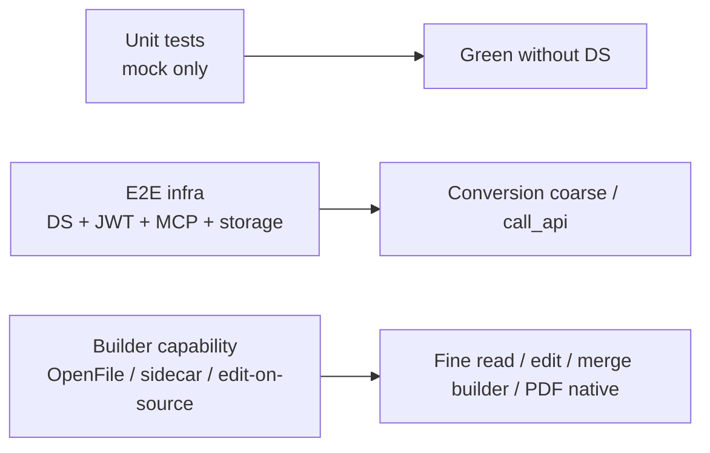

# Office MCP — 测试矩阵与能力边界

> **目的**：汇总 `tests/office_mcp/` 全量测试结果，区分 **单元测试（无需 DS）**、**E2E（需 live DocumentServer + MCP + 存储）**，以及 **Phase 2 / 后续版本** 才实现的产品能力。  
> **真源**：本文件 + 各 vertical [UPGRADE](./OFFICE_MCP_PDF_UPGRADE.md) §1.3 非目标 + [ADR-021](./ADR.md) DS 探针。  
> **最后全量跑数**：2026-06-24（`.env.test` 已配置，`DOCUMENTSERVER_URL=http://100.70.32.65:9000`）

---

## 1. 如何运行

| 命令 | 用途 | 是否需要 live DS |
|------|------|------------------|
| `python3 -m pytest tests/office_mcp/ -m "not e2e" -q` | **单元 / mock**（CI 默认） | 否 |
| `python3 -m pytest tests/office_mcp/ -m e2e -q` | **E2E**（需 `.env.test`） | 是 |
| `python3 -m pytest tests/office_mcp/ -q` | **全量**（unit + e2e） | E2E 部分需要 |

**E2E 前置**（见 [`.env.test.example`](../.env.test.example)）：

- `DOCUMENTSERVER_URL` + `DOCUMENTSERVER_JWT_SECRET`
- `E2E_MCP_URL`（MCP 进程可达）
- `E2E_SOURCE_PATH` / `E2E_SPREADSHEET_SOURCE_PATH`（`s3://` 或 `gs://`）
- 可选：`E2E_MCP_PUBLIC_URL`（Builder script_to_url 探针）、`E2E_PDF_ACROFORM_SOURCE_PATH`

**ADR-021**：未设置 `DOCUMENTSERVER_URL` 时，所有 `@pytest.mark.e2e` **整包 skip**（不 fail）。  
Builder 能力不满足时，各 vertical **按探针 lazy skip**（不 fail、不用 placeholder assert）。

---

## 2. 本次全量测试结果（2026-06-24）

```
pytest tests/office_mcp/ -v --tb=no
→ 480 collected
→ 450 passed | 29 skipped | 1 failed
→ 耗时 ~23 分钟（含 live DS E2E）
```

### 2.1 单元测试（`-m "not e2e"`）

- **不依赖 DocumentServer**；mock `resolve_document_source` / `run_builder_script` / Conversion 等。
- **CI**：[`.github/workflows/ci-office-mcp.yml`](../.github/workflows/ci-office-mcp.yml) 仅跑此层；**必须全绿**。
- 各 vertical 约计：Word ~80+、Presentation ~56+、Spreadsheet ~52+、PDF **69**、Gateway/Legacy/Registry/Security ~180+（与全量 480 之差为 **~44 个 E2E**）。

### 2.2 E2E 通过（14，需 live DS + MCP + 存储）

| 区域 | 用例 | 依赖能力 |
|------|------|----------|
| Gateway | `test_e2e_office_execute_builder_creates_docx_with_content` | Builder CreateFile docx |
| Gateway | `test_e2e_office_call_api_convert_docx_to_pdf` | Conversion API |
| Gateway | `test_e2e_office_call_api_info_calls_command_api` | Command API |
| Legacy | `test_e2e_legacy_office_read_document_returns_structure` | Conversion → html/txt/csv |
| Legacy | `test_e2e_legacy_office_edit_document_modifies_content` | Builder OpenFile + Search |
| Legacy | `test_e2e_legacy_office_apply_template_fills_placeholders` | Builder template |
| Legacy | `test_e2e_minio_office_read_document` | MinIO + Conversion |
| Word | `test_e2e_create_read_edit_word_docx` | docx create + sidecar read + edit |
| Word | `test_e2e_legacy_apply_template` / `test_e2e_legacy_edit_document_search` | legacy 别名 |
| Word | `test_e2e_read_document_docx_coarse` | legacy coarse html |
| PDF | `test_e2e_merge_pdfs_conversion` | Conversion 链式 merge |
| PDF | `test_e2e_read_document_pdf_coarse` | legacy pdf→txt（PDF-NA-01 冻结） |

### 2.3 E2E 失败（1）

| 用例 | 原因 | 归类 |
|------|------|------|
| `test_e2e_legacy_office_merge_documents_produces_merged_file` | `DocumentServer did not return fileUrl`（Builder merge 路径） | **DS 安装限制**（见 §3.2）；非 Phase 2 |

### 2.4 E2E 跳过（29）

| 跳过原因 | 数量 | 代表用例 |
|----------|------|----------|
| PDF Builder fine read / edit / fill / native create（ADR-021） | 6 | `test_e2e_create_read_pdf_two_pages` … |
| Presentation pptx/odp Builder（探针 `presentation_*_supported`） | 8 | `test_e2e_create_read_presentation_pptx` … |
| Spreadsheet fine read / ods / merge / edit / template（探针） | 6 | `test_e2e_create_read_edit_spreadsheet_xlsx` … |
| Spreadsheet xls fixture 未配置 | 1 | `test_e2e_read_spreadsheet_xls` |
| Word odt create / merge Builder | 3 | `test_e2e_merge_word_odt` … |
| OpenAI format 未启用 | 1 | `test_openai_endpoint_disabled` |
| 无 `/providers` 端点 | 4 | `test_provider_endpoints` |

---

## 3. 需 live DocumentServer 支持的功能

### 3.1 三层依赖模型



| 层级 | 说明 | 无 DS 时 |
|------|------|----------|
| **L0 单元** | handler / builder 脚本 / schema / parser | 全绿 |
| **L1 E2E 基础设施** | DS healthcheck、JWT、MCP `/health`、s3/gs 路径 | e2e skip 或 infra 失败 |
| **L2 Conversion** | `convert_and_fetch`、legacy `office_read_document` coarse | 本环境 **可用** |
| **L3 Builder 通用** | `CreateFile`/`OpenFile`/`SaveFile`、sidecar JSON | 本环境 **部分不可用**（见探针） |
| **L4 类别特化 API** | `GetSheetsCount`、PDF native、`page.GetAllWidgets` 等 | 按 DS 版本/构建差异 skip |

### 3.2 本环境 DS 探针结果（2026-06-24）

`probe_ds_capabilities(http://100.70.32.65:9000)`：

| 探针 | 结果 | 影响 |
|------|------|------|
| `reachable` | ✅ | E2E 可跑 |
| `conversion_available` | ✅ | coarse read、call_api convert、PDF conversion merge |
| `builder_available` | ❌ | Builder smoke 未通过（`fileUrl` error -4） |
| `get_sheets_count` | ❌ | spreadsheet **fine read** E2E skip |
| `pdf_native_create` | ❌ | PDF **native create / fine read / edit / fill** E2E skip |

**结论**：当前 DS 适合验证 **Conversion 粗读 / API 网关 / Word docx 主路径**；**PDF/Spreadsheet/Presentation 的 Builder 精细化 E2E** 需升级 DS（建议 ONLYOFFICE Docs **≥ 9.3** 且 Builder `fileUrl` 正常）或换完整安装。

### 3.3 按工具：live DS 需求一览

| 工具 | 单元测试 | E2E 最低层 | Builder / 特化 API | 本环境 E2E |
|------|----------|------------|-------------------|------------|
| `office_execute_builder` | ✅ | L3 | CreateFile | ✅ docx |
| `office_call_api` | ✅ | L2 | Conversion / Command | ✅ |
| **Word** ×6 + edit_script | ✅ | L3–L4 | sidecar read；odt CreateFile 可选 | ✅ docx 主路径；⏭ odt/merge |
| **Presentation** ×5 | ✅ | L3–L4 | GetPresentation sidecar；odp CreateFile | ⏭ 全部 Builder E2E |
| **Spreadsheet** ×5 | ✅ | L3–L4 | **GetSheetsCount** sidecar | ⏭ fine/edit/merge/ods |
| **PDF** ×5 | ✅ | L3–L4 | PDF native API；**GetAllWidgets**（form_fields） | ✅ conversion merge + legacy coarse；⏭ fine/edit/fill/create |
| **Legacy** ×4 | ✅ | L2–L3 | coarse + Builder 脚本 | ✅ 除 merge 外；❌ merge 1 例 |

**图例**：✅ 本次通过 · ⏭ ADR-021 skip · ❌ fail

### 3.4 E2E 能力探针函数（`tests/office_mcp/e2e_support.py`）

| 探针 | 门控 E2E |
|------|----------|
| `word_odt_builder_supported` | odt create / odt 往返 |
| `word_merge_builder_supported` | merge word / legacy merge |
| `spreadsheet_fine_read_supported` | read fine / create+read 主路径 |
| `spreadsheet_ods_builder_supported` | ods create |
| `spreadsheet_merge_builder_supported` | merge spreadsheets |
| `spreadsheet_edit_supported` | edit / template |
| `presentation_pptx_create_supported` | pptx create/read/edit/merge/template |
| `presentation_odp_create_supported` | odp 往返 |
| `pdf_fine_read_supported` | read fine / create 2 页 / edit 前置 |
| `pdf_fill_form_supported` | fill acroform |
| `probe_ds_capabilities` | `get_sheets_count`、`pdf_native_create` 会话级 |

---

## 4. Phase 2 / 后续版本实现（非当前 DS 问题）

以下能力在 **M6/M7 v1 规格中明确不做或标为 v2**；单元测试已覆盖 handler/schema，**产品行为待 Phase 2**。

### 4.1 跨类别（架构级 NA）

| ID | 能力 | 说明 |
|----|------|------|
| OT-NA-01 | `office_apply_template_pdf` | 用 `office_fill_pdf_form`（ADR-030） |
| OT-NA-05 | `office_read_document` → fine read 透明转发 | 行为冻结；各 vertical 用 `office_read_{category}` |
| OT-NA-09 | M3 后 `core/` feature 增强 | 须单独 PR（ADR-029） |

### 4.2 Word（[UPGRADE §1.3](./OFFICE_MCP_WORD_UPGRADE.md) + W4 后续）

| Phase 2 | v1 现状 |
|---------|----------|
| 脚注 / endnote **完整 CRUD** | v1 可只读存在性；v1.1 已有 `insert_section_break` |
| 图片 block **完整** insert/replace | 有限 op / Builder 直写 |
| 修订模式、批注完整 CRUD | 非 v1 |
| MERGEFIELD 邮件合并域 | 用 template + `office_apply_template_word` |
| DocumentEditor 嵌入 URL | 非 MCP 范围 |
| `relative_index` 定位 | **禁止**（ADR-011） |

### 4.3 Presentation（[UPGRADE §1.3](./OFFICE_MCP_PRESENTATION_UPGRADE.md)）

| Phase 2 | v1 现状 |
|---------|----------|
| 动画 / 切换效果 CRUD | 非 v1 |
| 演讲者备注完整 CRUD | v1 可只读 notes 文本 |
| 图表数据系列精细编辑 | v1 识别 chart 存在与标题 |
| create `options.template_path` | **ADR-046 无**；用 apply_template 或 read→create |
| layout fuzzy match | **禁止**（ADR-016） |

### 4.4 Spreadsheet（[UPGRADE §1.3](./OFFICE_MCP_SPREADSHEET_UPGRADE.md) + v2）

| Phase 2 | v1 现状 |
|---------|----------|
| pivot、宏/VBA、复杂条件格式 | 非 v1 |
| 公式引擎级语义 / 重算文档 | v1 写入公式字符串 |
| 图表系列精细改 | v1 识别 chart |
| `default_col_width` | **ADR-032** 已从 schema 移除；v2 或 execute_builder |
| 实时协同 | 非 v1 |
| `.xls` **新建**推荐格式 | 可读；新建推荐 xlsx/ods |

### 4.5 PDF（[UPGRADE §1.3](./OFFICE_MCP_PDF_UPGRADE.md) + v2）

| Phase 2 | v1 现状 |
|---------|----------|
| **block type `image`** | v1：`paragraph`、`table`（fine read 已区分 table） |
| 扫描件 **OCR** | 非 MCP；read 空 blocks + 提示 |
| 数字签名 / 加密 / 权限位 | 非 v1 |
| 复杂 redaction 工作流 | v1 简单 annotation 子集 |
| `.djvu` / `.xps` / `.oxps` **创建/编辑** | v1 仅 coarse read（Conversion txt） |
| `SetFormsData` 批量填表 | **禁止**；逐字段 SetValue（ADR-019） |
| `edit_pdf.fill_form_field` op | **禁止**（ADR-030） |
| create native 失败 **auto** via_docx | **禁止**（ADR-017） |
| merge builder 失败 **silent** conversion | **禁止**（ADR-018） |
| Rich 版式报告 | 推荐 word→convert pdf |

### 4.6 Gateway / Legacy Phase 2

| 项 | 说明 |
|----|------|
| Legacy shim 删除 | **OT-NA-11** / ADR-022：单独 breaking PR |
| `/providers` OpenAPI 端点 | 当前测试 skip；非 office canonical 工具面 |
| MinIO E2E | 可选环境；非 vertical 功能 |

---

## 5. 推荐验收矩阵（换 DS 后复测）

升级 DocumentServer 后，按优先级复跑：

```bash
# 1. 单元（必须绿）
python3 -m pytest tests/office_mcp/ -m "not e2e" -q

# 2. 探针
python3 tests/office_mcp/probe_ds_capabilities.py  # 或 session fixture ds_capabilities

# 3. 分 vertical E2E
python3 -m pytest tests/office_mcp/word/ -m e2e -q
python3 -m pytest tests/office_mcp/presentation/ -m e2e -q
python3 -m pytest tests/office_mcp/spreadsheet/ -m e2e -q
python3 -m pytest tests/office_mcp/pdf/ -m e2e -q
python3 -m pytest tests/office_mcp/test_e2e_office_tools.py -m e2e -q
```

| DS 能力到位后应解锁 | E2E 文件 |
|---------------------|----------|
| `get_sheets_count=true` | `spreadsheet/test_e2e_spreadsheet_tools.py` 主路径 |
| `pdf_native_create=true` + sidecar | `pdf/test_e2e_pdf_tools.py` PDF-037–043 |
| `presentation_pptx_create` | `presentation/test_e2e_presentation_tools.py` |
| `word_merge_builder` | `word/test_e2e_word_tools.py` merge + legacy merge |
| Builder `fileUrl` 稳定 | legacy merge、PDF builder merge |

---

## 6. 相关文档

| 文档 | 内容 |
|------|------|
| [implementation_design.md §13](./implementation_design.md) | DS 版本 / sidecar 风险 |
| [ADR-021](./ADR.md) | E2E skip 策略 |
| [**OFFICE_MCP_LIVE_DS_ISSUES.md**](./OFFICE_MCP_LIVE_DS_ISSUES.md) | **Live DS 已知问题与修复清单** |
| 各 vertical `OFFICE_MCP_*_UPGRADE.md` §1.3 | Phase 2 非目标原文 |
| 各 vertical `*_IMPLEMENTATION_TASKS_BY_FILE.md` | 任务 ID 与 E2E gate |

**维护**：每次 major E2E 跑数或 DS 升级后，更新 **§2 跑数** 与 **§3.2 探针** 表格；DS 故障与修复进展见 [**OFFICE_MCP_LIVE_DS_ISSUES.md**](./OFFICE_MCP_LIVE_DS_ISSUES.md)。
