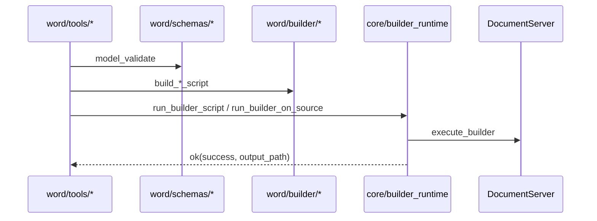
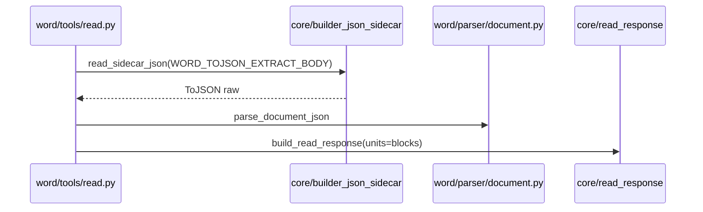

# Office MCP Word — Implementation Design

Word 垂直模块的**独立实现设计**：在 [OFFICE_MCP_WORD_UPGRADE.md](./OFFICE_MCP_WORD_UPGRADE.md)（What/LLM 规格）与 [implementation_design.md](./implementation_design.md)（全局 How）基础上，描述 **M2 W0–W3 + M3 注册** 的**已实现**代码结构、Core 集成、Schema/Parser/Builder API、Registry 暴露与验收标准。

> **状态**：**Implemented**（M0–M3 Word 交付完成；registry 终态 23/27 随 M4–M6 递增）  
> **读者**：维护工程师、Reviewers、E2E 维护者  
> **规格源**：[OFFICE_MCP_WORD_UPGRADE.md](./OFFICE_MCP_WORD_UPGRADE.md)  
> **架构约束**：[OFFICE_TOOL_ARCHITECTURE_REORG.md](./OFFICE_TOOL_ARCHITECTURE_REORG.md) §2、§7.1

---

## 1. 文档关系

| 文档 | 角色 |
|------|------|
| [OFFICE_MCP_WORD_UPGRADE.md](./OFFICE_MCP_WORD_UPGRADE.md) | **What**：工具参数、block schema、operations 语义、LLM 工作流 |
| **本文档** | **How（Word 局部）**：目录树、已实现 API、Builder 映射、测试与 Gate |
| [implementation_design.md](./implementation_design.md) | **How（全局）**：Core §4、Registry §5、统一 read §6、M2 §7.1 |
| [OFFICE_TOOL_IMPLEMENTATION_TASKS_BY_FILE.md](./OFFICE_TOOL_IMPLEMENTATION_TASKS_BY_FILE.md) | 全局 OT-046–082；**按文件展开**见 [OFFICE_MCP_WORD_IMPLEMENTATION_TASKS_BY_FILE.md](./OFFICE_MCP_WORD_IMPLEMENTATION_TASKS_BY_FILE.md) |
| 同上 Word tasks | **已完成**：WT-037–049（E2E、schema、v1.1、文档卫生）见 tasks 文档 **Group H–K** |
| [OFFICE_MCP_WORD_LLM_GUIDE.md](./OFFICE_MCP_WORD_LLM_GUIDE.md) | LLM 调用示例（与 `_locator_note` 一致） |
| [ADR.md](./ADR.md) | Word 相关已采纳决策（§2） |

**分工**：UPGRADE = 产品/LLM 规格；**本文档** = 代码真源与维护手册；`implementation_design.md` = 四类垂直总表。

---

## 2. 目标与成功标准

### 2.1 Word 模块目标

1. **六 canonical 工具**：`office_read_word`、`office_create_word`、`office_edit_word`、`office_merge_word`、`office_apply_template_word`、`office_edit_word_script`。
2. **读→改闭环**：`office_read_word`（fine ToJSON）→ `office_edit_word`（声明式 `operations[]`）→ re-read 验证。
3. **格式**：`.docx` / `.odt` / `.doc` 及 `core/categories.WORD_EXTENSIONS` 内扩展名；`SaveFile` / `CreateFile` 跟 `output_path` 扩展名。
4. **架构**：`word/` 仅依赖 `core/`；不 import 其他 vertical；handler 经 `registry.py` 注册。
5. **兼容**：legacy 三别名 `call_tool` 转发；`office_read_document` 粗读行为冻结。

### 2.2 Release Gates（Word 子集）

> **状态（2026-06）**：W0–W3、M3、W-E2E 与 v1.1 均已满足。

| Gate | 条件 | 状态 |
|------|------|------|
| **W0** | `word/` 目录迁移；单元测试全绿；merge/template/edit_script **无行为回归** | ✅ |
| **W1** | `parser/document.py` 单测 + `office_read_word` fine/coarse/outline/text | ✅ |
| **W2** | create → read → edit → read（docx + odt） | ✅ |
| **W3** | merge 输出 ext 跟 `output_path`；legacy 三别名 + template | ✅ |
| **M3** | 六工具在 `registry.CANONICAL_MODULES`；`tests/office_mcp/word/`；**M3 registry 8/12** | ✅ |
| **W-E2E** | DS 自动化 E2E（WT-037–042；`test_e2e_word_tools.py`） | ✅ |
| **v1.1** | insert 定位、search_replace scope、W4 `insert_section_break`（WT-046–048） | ✅ |

### 2.3 非目标（v1 未实现）

- 修订/批注/脚注完整 CRUD
- `relative_index` 定位（**ADR-011**）
- `delete_block` 作用于表格块（**ADR-010**）
- 从 `list_tools` 移除 legacy 名（**ADR-024** breaking PR）
- Word 模块内 OCR / 邮件合并域

---

## 3. 已实现代码结构

### 3.1 目录树（Canonical）

```
aiecs/tools/office_tool/word/
├── __init__.py
├── parser/
│   ├── __init__.py
│   ├── html.py              # Conversion HTML → structure（legacy + coarse read）
│   └── document.py          # ToJSON → blocks[]；WORD_TOJSON_EXTRACT_BODY
├── builder/
│   ├── __init__.py
│   ├── create.py            # build_create_script
│   ├── edit.py              # build_edit_script
│   ├── merge.py             # build_merge_script（output_ext 跟 path）
│   └── template.py          # build_apply_template_script
├── schemas/
│   ├── __init__.py
│   ├── read.py              # WordReadArgs
│   ├── section_spec.py      # SectionSpec + create/merge/template/edit_script args
│   └── edit_ops.py          # EditOperation + WordEditArgs
└── tools/
    ├── read.py              # office_read_word
    ├── create.py            # office_create_word
    ├── edit.py              # office_edit_word
    ├── merge.py             # office_merge_word
    ├── template.py          # office_apply_template_word
    └── edit_script.py       # office_edit_word_script
```

**根目录**：M7 后已无 `html_parser.py` / `merge_document.py` 等 shim（**ADR-022** 已删除）；仅 `registry.py` + `__init__.py` 留在 `office_tool/` 根。

### 3.2 依赖规则（已实现）

```
word/tools/*     → word/builder/*, word/schemas/*, word/parser/*, core/*
word/builder/*   → core/builder_js, core/categories（不 import tools）
word/parser/*    → stdlib；html.py 用 bs4
word/*           ↛ presentation | spreadsheet | pdf
core/*           ↛ word（ADR-029 freeze）
```

### 3.3 工具矩阵

| MCP 工具名 | 模块 | Registry | Legacy |
|------------|------|----------|--------|
| `office_read_word` | `word/tools/read.py` | canonical | — |
| `office_create_word` | `word/tools/create.py` | canonical | — |
| `office_edit_word` | `word/tools/edit.py` | canonical | — |
| `office_merge_word` | `word/tools/merge.py` | canonical | `office_merge_documents` |
| `office_apply_template_word` | `word/tools/template.py` | canonical | `office_apply_template` |
| `office_edit_word_script` | `word/tools/edit_script.py` | canonical | `office_edit_document` |
| `office_read_document` | `legacy/read_document.py` | — | call_tool only |

每个 canonical 模块导出：`TOOL_NAME`, `TOOL_DEF`, `handler`。Description 前缀 **`[Word]`**（**ADR-025**）。

---

## 4. Core 层集成

Word 模块**不重复实现**下列 Core API（见 `implementation_design.md` §4）：

| Core 模块 | Word 用途 |
|-----------|-----------|
| `core/categories.py` | `assert_category_path("word", path)`；`builder_file_ext(output_path)`；`llm_coarse_output_type` |
| `core/errors.py` | 全部 handler 返回 `err()` / `ok()`（**ADR-006**） |
| `core/read_response.py` | `office_read_word` 结构化响应（**ADR-028**）；mirror `blocks[]` |
| `core/builder_json_sidecar.py` | fine read：`read_sidecar_json(..., WORD_TOJSON_EXTRACT_BODY)` |
| `core/coarse_read.py` | `convert_and_fetch`（coarse / `read_mode=coarse`） |
| `core/coarse_parsers/html.py` | 与 `word/parser/html.py` 配合（legacy 路径） |
| `core/source.py` | `resolve_document_source` |
| `core/builder_runtime.py` | `run_builder_script`（create/merge/template）；`run_builder_on_source`（edit/edit_script） |
| `core/builder_js.py` | `escape_js`, `open_file`, `save_file`, `close_file` |
| `core/storage/*` | upload、backup、`ACCEPTED_SOURCE_PATH_FORMATS` |

### 4.1 统一 read 响应（Word）

`build_read_response(category="word", units=blocks, ...)` 产出：

| 字段 | 说明 |
|------|------|
| `category` | `"word"` |
| `units` / `blocks` | **同内容** mirror（`read_response._CATEGORY_ALIASES`） |
| `unit_count` | `len(blocks)` |
| `read_mode` | `"fine"` \| `"coarse"` |
| `_locator_note` | 固定文案，指向 `office_edit_word` |
| `word_count` | `word_count_from_blocks(blocks)` |
| `source_path` / `source_path_format` | 存储路径 |
| `extra` | 如 `conversion_output_type`, `_truncated` |

`format=text` 时返回 `ok(text=...)`，不走 `build_read_response`。

---

## 5. Pydantic Schemas（ADR-002）

路径：`word/schemas/`。Handler 入口统一 `Model.model_validate(raw)`。

### 5.1 `schemas/read.py`

```python
class WordReadOptions(BaseModel):
    read_mode: Literal["fine", "coarse"] = "fine"
    include_tables: bool = True
    max_blocks: int | None = Field(default=None, ge=1)

class WordReadArgs(BaseModel):
    source_path: str | None = None
    source_url: str | None = None
    format: Literal["structured", "outline", "text"] = "structured"
    options: WordReadOptions = Field(default_factory=WordReadOptions)
    # validator: exactly one of source_path | source_url
```

### 5.2 `schemas/section_spec.py`

```python
SectionType = Literal[
    "heading1", "heading2", "heading3",
    "paragraph", "bullets", "table", "page_break",
]

class SectionSpec(BaseModel): ...       # type_fields validator
class WordCreateOptions(BaseModel):
    title: str | None = None
    page_size: Literal["A4", "Letter"] | None = None
    add_toc: bool = False               # ADR-012: 文首，create 脚本第一段 Push 前

class WordCreateArgs(BaseModel):
    sections: list[SectionSpec] = Field(min_length=1)
    output_path: str
    options: WordCreateOptions = ...

class WordMergeOptions(BaseModel):
    add_page_break: bool = False
    add_toc: bool = False

class WordMergeArgs(BaseModel): ...     # source_paths XOR source_urls
class WordTemplateArgs(BaseModel): ...  # template_path XOR template_url
class WordEditScriptArgs(BaseModel): ... # edit_script + source + output_path
```

### 5.3 `schemas/edit_ops.py`

```python
OpName = Literal[
    "search_replace", "set_block_text", "set_heading",
    "insert_paragraph", "insert_bullets", "insert_table",
    "delete_block", "apply_style", "add_page_break", "insert_toc",
]

class EditOperation(BaseModel):
    op: OpName
    search_string: str | None = None      # search_replace（UPGRADE 示例用 search；实现为 search_string）
    replace_string: str | None = None
    block_index: int | None = Field(default=None, ge=0)
    heading_path: list[str] | None = None
    match_text: str | None = None
    text: str | None = None
    style_name: str | None = None
    items: list[str] | None = None
    rows: list[list[str]] | None = None
    after: str | Literal["start", "end"] | None = None
    block_type: str | None = None         # delete_block + table → ValidationError (ADR-010)

class WordEditArgs(BaseModel):
    source_path | source_url, output_path, operations[], options.backup
```

**ADR-011**：schema 层拒绝 `relative_index` 字段。

---

## 6. Parser 层

### 6.1 `parser/document.py`

**公共 API**（已实现）：

```python
WORD_TOJSON_EXTRACT_BODY = """var doc = Api.GetDocument();
var jsonStr = JSON.stringify(doc.ToJSON(true, true, true, true, true, true));"""

def parse_document_json(raw: dict | str) -> list[dict]: ...
def blocks_to_outline(blocks: list[dict]) -> list[dict]: ...
def blocks_to_text(blocks: list[dict]) -> str: ...
def word_count_from_blocks(blocks: list[dict]) -> int: ...
```

**Block 字段**：`block_index`, `type`（`heading1`–`heading3`, `paragraph`, `table`, …）, `text`, `style_name?`, `heading_path?`, `rows?`, `row_count?`, `col_count?`。

**算法**：

1. `_iter_body_nodes` 从 ToJSON 根取 `content` / `elements` / `body` / `document`。
2. 顺序遍历；维护 `heading_stack` 生成 `heading_path`。
3. 表格：解析 `rows` / `cells` → `rows[][]`。
4. `max_blocks` 在 `read.py` 截断，extra 设 `_truncated: true`。

### 6.2 `parser/html.py`

自原 `html_parser.py` 迁入：`parse_html_to_structure`, `extract_plain_text`。供：

- `office_read_word` `read_mode=coarse`
- `legacy/read_document.py` word 类 Conversion 粗读

**注意**：HTML `elements[].index` **不可**用于 Builder 编辑；与 fine read 的 `block_index` 无关。

---

## 7. Builder 脚本生成

输出扩展名：**`builder_file_ext(output_path)`**（非写死 `docx`）。

### 7.1 `builder/create.py`

```python
def build_create_script(
    sections: list[SectionSpec],
    *,
    output_ext: str,
    options: WordCreateOptions,
) -> str:
```

| Section type | JS 要点 |
|--------------|---------|
| `heading1`–`3` | `CreateParagraph` → `AddText` → `SetStyle("Heading N")` → `doc.Push` |
| `paragraph` | `CreateRun` + 可选 `SetBold` |
| `bullets` | 逐条 `Push`，前缀 `\u2022` |
| `table` | `CreateTable` + 填 cell |
| `page_break` | `AddPageBreak` → `Push` |
| `add_toc`（options） | **`doc.AddTableOfContents({})` 在 sections 循环之前**（ADR-012） |

执行：`run_builder_script(script, output_path=...)`.

### 7.2 `builder/edit.py`

```python
def build_edit_script(operations: list[EditOperation], *, file_ext: str) -> str:
    """Body only — Open/Save 由 run_builder_on_source 注入。"""
```

| op | 实现策略（as-built） |
|----|----------------------|
| `search_replace` | `doc.SearchAndReplace({searchString, replaceString})` |
| `set_block_text` / `delete_block` / `apply_style` | **`block_index` → `doc.GetElement(block_index)`**；否则 `doc.Search(snippet)` |
| `set_heading` | 同上定位 + `SetText` + `SetStyle("Heading N")` |
| `insert_paragraph` | `after=="start"` → `InsertContent`；否则 `Push` |
| `insert_bullets` | 多条 `Push` |
| `insert_table` | `CreateTable` + `Push` |
| `add_page_break` | 文档末尾 `Push` 分页段 |
| `insert_toc` | `MoveCursorToStart` + `AddTableOfContents`（ADR-012） |

**定位语义（与 UPGRADE 差异见 §15）**：`block_index` 与 ToJSON body 顶层元素顺序对齐时使用 `GetElement`；`heading_path` / `match_text` 走 `Search`。

执行：`run_builder_on_source(..., backup_source_path=...)`.

### 7.3 `builder/merge.py`

```python
def build_merge_script(
    signed_urls, file_exts, *, output_path, add_page_break, add_toc
) -> str:
    output_ext = builder_file_ext(output_path)  # ✅ 非写死 docx
    # OpenFile → ToJSON → CreateFile(output_ext) → FromJSON merge → SaveFile(output_ext)
```

`add_toc`：`MoveCursorToStart` + `AddTableOfContents`（merge 完成后、Save 前）。

### 7.4 `builder/template.py`

`build_apply_template_script`：`OpenFile` → 循环 `SearchAndReplace("{{key}}", str(value))` → `SaveFile`.

---

## 8. Tool Handlers

### 8.1 `office_read_word`（`tools/read.py`）

```
WordReadArgs validate
→ resolve_document_source → assert word category
→ branch:
    fine + structured|outline|text:
      read_sidecar_json(WORD_TOJSON_EXTRACT_BODY)
      parse_document_json → blocks
      format=outline → blocks_to_outline
      format=text → ok(text=blocks_to_text)
      else build_read_response(units=blocks, read_mode=fine, locator_note=LOCATOR_NOTE)
    coarse (or fine sidecar failure path via read_mode=coarse):
      convert_and_fetch → html parser → build_read_response(read_mode=coarse)
```

### 8.2 `office_create_word`

`WordCreateArgs` → `build_create_script` → `run_builder_script`.

### 8.3 `office_edit_word`

`WordEditArgs` → `build_edit_script` → `run_builder_on_source`；可选 `copy_source_to_backup`.

### 8.4 `office_merge_word` / `office_apply_template_word` / `office_edit_word_script`

- **merge**：解析多源 signed URL → `build_merge_script` → `run_builder_script`
- **template**：resolve template → `build_apply_template_script` → `run_builder_on_source`
- **edit_script**：validate `WordEditScriptArgs` → 用户 `edit_script` body → `run_builder_on_source`

---

## 9. Registry 与 MCP 暴露

### 9.1 Canonical 注册

`registry.py` → `CANONICAL_MODULES`（Word 段，序号 3–8）：

```python
"aiecs.tools.office_tool.word.tools.read",
"aiecs.tools.office_tool.word.tools.create",
"aiecs.tools.office_tool.word.tools.edit",
"aiecs.tools.office_tool.word.tools.merge",
"aiecs.tools.office_tool.word.tools.template",
"aiecs.tools.office_tool.word.tools.edit_script",
```

| 里程碑 | `collect_office_tools()` 含 Word | `get_handlers()` 含 Word+legacy |
|--------|-----------------------------------|----------------------------------|
| **M3** | gateway×2 + word×6 = **8** | **12**（+4 legacy） |
| M6 终态 | **23** | **27** |

### 9.2 Legacy 别名

`legacy/edit_document.py`, `merge_documents.py`, `apply_template.py` 导出 `LEGACY_ALIASES` → registry `get_handlers()` **不**进入 `collect_office_tools()`（**ADR-024**）。

`legacy/read_document.py`：全类别粗读；word 仍走 Conversion HTML。

---

## 10. 数据流

### 10.1 写路径（Create / Edit / Merge / Template）



### 10.2 读路径（Fine）



### 10.3 读路径（Coarse）

```
resolve_document_source
→ convert_and_fetch(llm_coarse_output_type)
→ word/parser/html.parse_html_to_structure
→ build_read_response(read_mode=coarse)
```

---

## 11. 测试策略

### 11.1 目录（已实现）

```
tests/office_mcp/word/
├── test_document_parser.py
├── test_read_word.py
├── test_create_word.py
├── test_edit_word.py
├── test_edit_builder.py          # build_edit_script 断言
├── test_merge_word.py
├── test_schemas.py               # ADR-010/011/012
├── test_legacy_compat.py
├── test_e2e_word_tools.py        # @pytest.mark.word @pytest.mark.e2e
├── test_office_edit_document.py  # legacy 路径回归
├── test_office_merge_document.py
└── test_office_apply_template.py
```

### 11.2 单元测试要点

| 文件 | 覆盖 |
|------|------|
| `test_document_parser.py` | ToJSON fixture → blocks / heading_path / table |
| `test_schemas.py` | `delete_block`+table 拒绝；无 `relative_index` |
| `test_merge_word.py` | `output_path=*.odt` → script 含 `SaveFile("odt", ...)` |
| `test_edit_builder.py` | `block_index` → `GetElement`；Search fallback |

### 11.3 E2E 清单

> **状态（WT-042）**：✅ 已实现于 `tests/office_mcp/word/test_e2e_word_tools.py`（`@pytest.mark.word` `@pytest.mark.e2e`）。部分 DS 对 odt create / multi-doc merge 会 skip；docx create/read/edit 与 legacy smoke 为必过项。

1. create docx → read_word structured → `block_index` / `heading_path`
2. edit_word：`set_heading` + `insert_bullets` + `search_replace` → re-read
3. odt 往返：create odt → edit → save odt
4. merge_word → `output_path` 以 `.odt` 结尾
5. legacy：`office_merge_documents` / `office_apply_template` / `office_edit_document` 行为等价
6. `office_read_document` docx 粗读不变（**OT-NA-05**）

```bash
poetry run pytest tests/office_mcp/word/ -v -m "not e2e"
DOCUMENTSERVER_URL=... DOCUMENTSERVER_JWT_SECRET=... \
  poetry run pytest tests/office_mcp/word/ -v -m "word and e2e"
```

---

## 12. 验收命令（Word Gate）

```bash
cd "$(git rev-parse --show-toplevel 2>/dev/null || pwd)"

# 结构
test -f aiecs/tools/office_tool/word/tools/read.py
test -f aiecs/tools/office_tool/word/parser/document.py

# 单元
poetry run pytest tests/office_mcp/word/ -v -m "not e2e"

# Registry（M3 里程碑；全 repo 终态 23/27）
python3 -c "
from aiecs.tools.office_tool.registry import collect_office_tools, get_handlers
names = {t['name'] for t in collect_office_tools()}
for n in ['office_read_word','office_create_word','office_edit_word',
          'office_merge_word','office_apply_template_word','office_edit_word_script']:
    assert n in names, n
assert 'office_merge_documents' not in names
print('OK: word canonical in list_tools')
"

# 依赖审计
! rg "from aiecs.tools.office_tool.(presentation|spreadsheet|pdf)" aiecs/tools/office_tool/word/ && echo "OK: word isolated"
```

---

## 13. 实现状态（Checklist）

### W0

- [x] `word/parser/html.py` 迁入
- [x] `word/builder/merge.py` + `word/tools/merge.py`
- [x] `word/builder/template.py` + `word/tools/template.py`
- [x] `word/tools/edit_script.py`
- [x] `legacy/*` 三个别名模块

### W1

- [x] `parse_document_json` + `WORD_TOJSON_EXTRACT_BODY`
- [x] `office_read_word` fine/coarse/outline/text
- [x] `build_read_response` + `blocks`/`units` mirror

### W2

- [x] Pydantic schemas（section_spec + edit_ops）
- [x] `office_create_word` + `office_edit_word`
- [x] E2E create/edit（docx/odt）

### W3

- [x] merge `SaveFile` 跟 `output_path` ext
- [x] `office_apply_template_word` + legacy 别名
- [x] `delete_block` ADR-010（schema 拒绝 table）

### M3

- [x] registry 六 word canonical
- [x] `[Word]` description 前缀
- [x] `tests/office_mcp/word/` 测试目录

---

## 14. 与 UPGRADE / LLM 指南同步说明

UPGRADE 与 LLM 指南已对齐 **`word/schemas/edit_ops.py`** 字段名与 as-built Builder 行为。维护时以**代码**为准：

| 项 | 真源 |
|----|------|
| MCP 参数名 | `word/schemas/*` + 各 `tools/*` 的 `TOOL_DEF["inputSchema"]` |
| `search_replace` | **`search_string` / `replace_string`**；可选 **`scope: "subtree"`** + 定位 |
| `block_index` 编辑 | **`doc.GetElement(block_index)`**（fine read 块序） |
| `insert_paragraph.after` | **`"start"` \| `"end"`**、标题片段，或 `block_index` / `heading_path` / `match_text` |
| `insert_bullets` / `insert_table` | 支持定位插入；省略定位则 `Push` 到文档末尾 |
| `add_page_break` / `insert_section_break` | 可选定位；`insert_section_break` 为 W4 最小交付 |
| 根 import | 无根 shim（**ADR-022** 已删） |

---

## 15. 参考

- 规格：[OFFICE_MCP_WORD_UPGRADE.md](./OFFICE_MCP_WORD_UPGRADE.md)
- 全局：[implementation_design.md](./implementation_design.md) §4、§6、§7.1、§8.1–8.3
- 任务：[OFFICE_MCP_WORD_IMPLEMENTATION_TASKS_BY_FILE.md](./OFFICE_MCP_WORD_IMPLEMENTATION_TASKS_BY_FILE.md)（WT-001–036）· 全局 OT-046–082
- LLM：[OFFICE_MCP_WORD_LLM_GUIDE.md](./OFFICE_MCP_WORD_LLM_GUIDE.md)
- ADR：[ADR.md](./ADR.md) ADR-002、006、010–012、023–025、028、029
- ONLYOFFICE：[Document API](https://api.onlyoffice.com/docs/office-api/usage-api/document-api/) · [ToJSON](https://api.onlyoffice.com/docs/office-api/usage-api/document-api/ApiDocument/Methods/ToJSON/)

---

## 附录 A：单 PR 回归模板（Word _touch）

```markdown
## Word PR checklist
- [ ] poetry run pytest tests/office_mcp/word/ -v -m "not e2e"
- [ ] poetry run pytest tests/office_mcp/ -v -m "not e2e"  # 全量 unit
- [ ] 若改 registry：更新 test_registry 里程碑断言
- [ ] 未改 core/（或仅 ADR-029 bugfix）
- [ ] legacy 三别名 + office_read_document 回归
```

## 附录 B：OT-NA（Word 相关）

| ID | 禁止 |
|----|------|
| OT-NA-05 | `office_read_document` → fine read 透明转发 |
| OT-NA-06 | Word `relative_index` |
| OT-NA-09 | M3 后 core/ feature 增强 |
