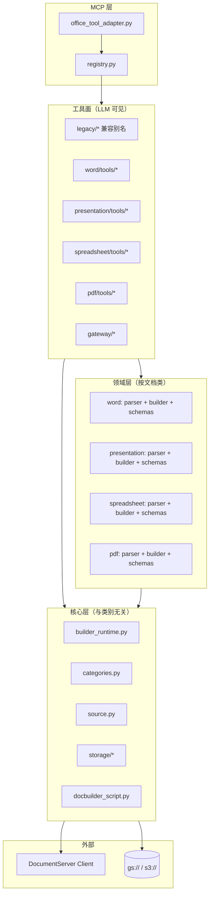
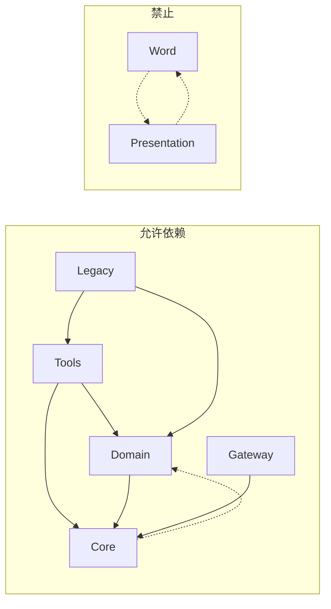

# Office Tool 文件架构重组分析

面向 **Word / Presentation / Spreadsheet / PDF** 四类文档的精细化创建与精细化修改扩展，对 `aiecs/tools/office_tool/` 进行结构重组的设计分析。

> **状态**：架构设计（待评审 / 分阶段落地）  
> **关联文档**：[implementation_design.md](./implementation_design.md)（完整实现设计）、[OFFICE_TOOL_IMPLEMENTATION_TASKS_BY_FILE.md](./OFFICE_TOOL_IMPLEMENTATION_TASKS_BY_FILE.md)（按文件任务）、[OFFICE_MCP_WORD_UPGRADE.md](./OFFICE_MCP_WORD_UPGRADE.md)、[OFFICE_MCP_WORD_IMPLEMENTATION_DESIGN.md](./OFFICE_MCP_WORD_IMPLEMENTATION_DESIGN.md)、[OFFICE_MCP_WORD_LLM_GUIDE.md](./OFFICE_MCP_WORD_LLM_GUIDE.md)、[OFFICE_MCP_PRESENTATION_UPGRADE.md](./OFFICE_MCP_PRESENTATION_UPGRADE.md)、[OFFICE_MCP_PRESENTATION_IMPLEMENTATION_DESIGN.md](./OFFICE_MCP_PRESENTATION_IMPLEMENTATION_DESIGN.md)、[OFFICE_MCP_PRESENTATION_LLM_GUIDE.md](./OFFICE_MCP_PRESENTATION_LLM_GUIDE.md)、[OFFICE_MCP_SPREADSHEET_UPGRADE.md](./OFFICE_MCP_SPREADSHEET_UPGRADE.md)、[OFFICE_MCP_SPREADSHEET_IMPLEMENTATION_DESIGN.md](./OFFICE_MCP_SPREADSHEET_IMPLEMENTATION_DESIGN.md)、[OFFICE_MCP_SPREADSHEET_LLM_GUIDE.md](./OFFICE_MCP_SPREADSHEET_LLM_GUIDE.md)、[OFFICE_MCP_PDF_UPGRADE.md](./OFFICE_MCP_PDF_UPGRADE.md)、[OFFICE_MCP_PDF_IMPLEMENTATION_DESIGN.md](./OFFICE_MCP_PDF_IMPLEMENTATION_DESIGN.md)、[OFFICE_MCP_PDF_LLM_GUIDE.md](./OFFICE_MCP_PDF_LLM_GUIDE.md)  
> **原则**：先抽公共层，再按文档类别垂直切分；保留 legacy 工具名与行为，避免破坏现有 MCP 客户端。

---

## 1. 为什么要重组

### 1.1 当前结构（扁平 14 文件）

```
aiecs/tools/office_tool/
├── __init__.py
├── execute_builder.py      # 通用 Builder 执行
├── edit_document.py        # Word 向 edit（命名泛化、实现专一）
├── read_document.py        # 全类别粗读（Conversion + 解析）
├── merge_document.py       # 仅 Word 合并
├── apply_template.py       # 仅 Word 模板
├── call_api.py             # Conversion / Command 网关
├── conversion_output.py    # 扩展名 → 类别 / LLM output type
├── html_parser.py          # 仅 Word（HTML 结构解析）
├── docbuilder_script.py    # script → URL
├── source_resolver.py      # source_path / source_url 解析
├── storage.py              # 上传 / 签名 URL
├── storage_paths.py        # gs:// / s3:// 校验
└── object_fetch.py         # MCP 侧 object HTTP 代理
```

MCP 适配层单独维护工具列表：

```
aiecs/mcp/office_tool_adapter.py   # OFFICE_TOOLS + _TOOL_HANDLERS 手工注册
```

### 1.2 结构性问题

| 问题 | 表现 | 扩展四类后的风险 |
|------|------|------------------|
| **命名与实现错位** | `*_document` 暗示通用，实现绑 Word API | presentation / spreadsheet 只能另起炉灶，命名混乱 |
| **职责耦合** | 单文件含 schema、校验、脚本生成、DS 调用、存储 | 每新增一工具复制 ~150 行样板 |
| **重复代码** | `_escape_js` 在 merge / apply / edit 各有一份 | 四类 × 五能力 → 维护成本指数上升 |
| **解析器散落** | `html_parser` 挂根目录；presentation 规划另建 `presentation_parser` | 无统一 Parser 接口，LLM 返回 schema 不一致 |
| **类别知识分散** | `conversion_output` 有四级分类，工具层未对齐 | Excel/PDF 精细化时重复造轮子 |
| **注册手工化** | adapter 逐个 import / 注册 | 工具数 6 → 20+ 时易漏注册、测试遗漏 |
| **读路径不统一** | Word：Conversion→HTML；Presentation 规划：Builder JSON | 同类问题会在 spreadsheet 再次出现 |

### 1.3 扩展目标（四类 × 五能力）

「精细化创建 / 精细化修改」在各类别上的能力矩阵（目标态）：

| 能力 | Word | Presentation | Spreadsheet | PDF |
|------|------|--------------|-------------|-----|
| **read**（结构化） | ✅ 已有（HTML） | 📋 设计中（SlidesToJSON） | ⏳ 待建（Sheet JSON / csv+结构） | ⏳ 待建（页+块文本；或只读 convert） |
| **create**（声明式） | ⏳ 待建 | 📋 设计中 | ⏳ 待建 | ⏳ 有限（表单/合并；非全量创作） |
| **edit**（operations） | ⏳ 待建（现仅 edit_script） | 📋 设计中 | ⏳ 待建 | ⏳ 待建（注释、合并、拆分页） |
| **merge** | ✅ 已有 | 📋 设计中 | ⏳ 待建 | ⏳ 待建 |
| **template** | ✅ 已有 | 📋 设计中 | ⏳ 待建 | ⏳ 通常 N/A |

另保留 **gateway** 层：`office_execute_builder`、`office_call_api`（高级 / 转换）。

---

## 2. 重组目标架构

### 2.1 分层模型



**四层职责**：

1. **core**：存储、源解析、Builder 执行管线、JS 工具、扩展名分类——**不含** Word/PPT 业务语义。
2. **{word,presentation,spreadsheet,pdf}**：每类独立的 parser（读结构）、builder（生成 JS）、schemas（operations / slide spec / cell range）。
3. **tools**（类别内）：薄 MCP tool 定义 + 参数校验 + 调用 domain + runtime。
4. **legacy + gateway**：旧工具名转发；底层 API 逃生舱。

### 2.2 目标目录树

```
aiecs/tools/office_tool/
├── __init__.py                      # 导出 registry 与 public API
├── registry.py                      # 汇总 OFFICE_TOOLS / handlers（自动发现）
│
├── core/
│   ├── __init__.py
│   ├── categories.py                # ← conversion_output.py 迁入并扩展
│   ├── builder_runtime.py           # NEW: script_to_url → execute → download → upload
│   ├── builder_js.py                # NEW: escape_js, OpenFile/SaveFile 包装片段
│   ├── builder_json_sidecar.py      # NEW: Builder 中间 JSON/txt 回传（read 共用）
│   ├── coarse_read.py               # NEW: Conversion 粗读（legacy + read_* fallback）
│   ├── docbuilder_script.py         # ← docbuilder_script.py（script → URL）
│   ├── source.py                    # ← source_resolver.py
│   ├── errors.py                    # NEW: 统一 isError 格式（M1，可选 duck typing）
│   └── storage/
│       ├── __init__.py              # re-export upload, resolve_fetch_url, ...
│       ├── paths.py                 # ← storage_paths.py
│       ├── backend.py               # ← storage.py
│       └── object_fetch.py          # ← object_fetch.py
│
├── gateway/
│   ├── __init__.py
│   ├── execute_builder.py           # ← execute_builder.py
│   └── call_api.py                  # ← call_api.py
│
├── word/
│   ├── __init__.py
│   ├── parser/
│   │   ├── html.py                  # ← html_parser.py（Conversion HTML）
│   │   └── document.py              # ToJSON → blocks[] / units[]
│   ├── builder/
│   │   ├── merge.py                 # ← merge_document 脚本生成
│   │   ├── template.py              # ← apply_template 脚本生成
│   │   ├── create.py                # 未来：声明式 create_word
│   │   └── edit.py                  # 未来：operations → JS
│   ├── schemas/
│   │   ├── read.py                  # structured 返回 TypedDict / pydantic
│   │   ├── create.py
│   │   └── edit_ops.py
│   └── tools/
│       ├── read.py                  # office_read_word（新）+ 逻辑
│       ├── create.py
│       ├── edit.py
│       ├── merge.py                 # ← merge_document.py 工具面
│       ├── template.py              # ← apply_template.py 工具面
│       └── edit_script.py           # ← edit_document.py（高级 raw script）
│
├── presentation/
│   ├── parser/
│   │   └── slides.py                # SlidesToJSON → LLM slides[]
│   ├── builder/
│   │   ├── create.py
│   │   ├── edit.py
│   │   ├── merge.py
│   │   └── template.py
│   ├── schemas/
│   │   ├── read.py
│   │   ├── slide_spec.py
│   │   └── edit_ops.py
│   └── tools/
│       ├── read.py                  # office_read_presentation
│       ├── create.py
│       ├── edit.py
│       ├── merge.py
│       └── template.py
│
├── spreadsheet/
│   ├── parser/
│   │   ├── csv.py                   # Conversion csv 粗读
│   │   └── workbook.py              # Builder sidecar JSON → sheets[] / units[]
│   ├── builder/
│   │   ├── create.py
│   │   ├── edit.py
│   │   ├── merge.py
│   │   └── template.py
│   ├── schemas/
│   │   ├── read.py
│   │   ├── workbook_spec.py
│   │   └── edit_ops.py              # set_cell, set_range, add_sheet, ...
│   └── tools/
│       ├── read.py                  # office_read_spreadsheet
│       ├── create.py
│       ├── edit.py
│       ├── merge.py
│       └── template.py
│
├── pdf/
│   ├── parser/
│   │   ├── pages_txt.py             # Conversion txt → pages[] / units[]
│   │   └── document.py              # Builder sidecar JSON → pages[] / units[]
│   ├── builder/
│   │   ├── create.py
│   │   ├── merge.py                 # 合并 PDF（convert 链或 Builder pdf API）
│   │   ├── edit.py                  # 有限编辑（注释、水印——视 DS 能力）
│   │   └── fill_form.py
│   ├── schemas/
│   │   ├── read.py
│   │   └── edit_ops.py
│   └── tools/
│       ├── read.py                  # office_read_pdf
│       ├── create.py                # office_create_pdf
│       ├── edit.py                  # office_edit_pdf
│       ├── merge.py                 # office_merge_pdfs
│       └── fill_form.py             # office_fill_pdf_form
│
└── legacy/
    ├── __init__.py
    ├── read_document.py             # 薄包装 → 按 ext 路由或保持原粗读
    ├── edit_document.py             # 薄包装 → word/tools/edit_script 或 gateway
    ├── merge_documents.py           # 薄包装；源文件现为 merge_document.py
    └── apply_template.py
```

`aiecs/clients/documentserver_client.py` **保持独立**（已是正确的基础设施位置）。

---

## 3. 核心抽象（跨类别复用）

### 3.1 文档类别（categories）

将 `conversion_output.py` 升级为 `core/categories.py`，作为**全仓库唯一**的扩展名分类源。

> **可执行 API 以** [implementation_design.md §4.1](./implementation_design.md) **为准**（`builder_file_ext`、`assert_category_path` 等）。下列为概念示意：

```python
DocumentCategory = Literal["word", "presentation", "spreadsheet", "pdf", "unknown"]

def classify_file_ext(ext: str) -> DocumentCategory: ...
def llm_coarse_output_type(ext: str) -> str: ...   # 原 llm_output_type，供 legacy read
def builder_file_ext(output_path: str) -> str: ...  # SaveFile 扩展名
def assert_category_path(category: DocumentCategory, path: str) -> str | None: ...
```

各类 tool 在入口用 `classify_file_ext(output_path)` 校验「工具与文件类别是否匹配」。

### 3.2 Builder 运行时（builder_runtime）

> **签名与行为以** [implementation_design.md §4.2–4.3](./implementation_design.md) **为准**（`read_sidecar_json`、`wrap_script`、`backup_source_path` 等）。

抽取当前散落在各 tool 中的固定管线：

```python
async def run_builder_script(
    script: str,
    *,
    output_path: str | None = None,
    client: DocumentServerClient | None = None,
) -> dict:
    """
    script_to_url → execute_builder → [download] → [upload_to_storage]
    Returns: {success, file_url} or {success, output_path} or {isError, text}
    """

async def run_builder_on_source(
    source_url: str,
    file_ext: str,
    edit_script_body: str,
    output_path: str,
    *,
    wrap_open_save: bool = True,
) -> dict:
    """OpenFile + body + SaveFile 注入（原 office_edit_document 核心）"""
```

**收益**：presentation / spreadsheet / word 的 create/edit/merge/template 全部调用同一 runtime，超时与错误处理一处维护。

### 3.3 Builder JS 工具（builder_js）

```python
def escape_js(s: str) -> str: ...
def open_file(url: str, ext: str) -> str: ...
def save_file(ext: str, filename: str) -> str: ...
def close_file() -> str: ...
def comment(line: str) -> str: ...
```

消除各类别 builder 模块中的重复 `_escape_js`。

### 3.4 结构化读取 Sidecar（builder_json_sidecar）

Presentation / Spreadsheet 的 read 需从 Builder 取 JSON。统一：

```python
async def read_builder_sidecar_text(
    source_url: str,
    file_ext: str,
    extract_script: str,  # 类别提供：如何把 JSON 写入 sidecar txt
) -> str:
    """执行脚本 → 下载 sidecar → 返回文本"""
```

Word 继续使用 Conversion→HTML 路径，但可逐步增加 `Api.GetDocument().ToJSON()` 作为 **fine read** 备选（与 HTML read 并存）。

### 3.5 类别领域接口（建议 Protocol）

> **v1 不实现**（**ADR-027**）：不建 `core/protocols.py`；下列仅作 v2 评估参考。

每类实现同一套 **可选** 能力（无 merge 的类别可不实现）：

```python
# core/protocols.py（文档化接口，v1 可用 duck typing）

class FineRead(Protocol):
    async def read_structured(self, source, *, format: str, options: dict) -> dict: ...

class FineCreate(Protocol):
    async def create(self, spec: dict, output_path: str, options: dict) -> dict: ...

class FineEdit(Protocol):
    async def edit(self, source, output_path: str, operations: list, options: dict) -> dict: ...

class FineMerge(Protocol):
    async def merge(self, sources: list, output_path: str, options: dict) -> dict: ...

class FineTemplate(Protocol):
    async def apply_template(self, template, data: dict, output_path: str) -> dict: ...
```

**Parser** 与 **Builder** 分离：

| 组件 | 输入 | 输出 |
|------|------|------|
| `parser/*` | Builder JSON / HTML / CSV / sidecar txt | LLM schema（统一顶层字段见 §4） |
| `builder/*` | LLM spec / operations | Builder JavaScript 字符串 |

---

## 4. 统一 LLM 返回 schema（跨类别）

便于 Agent 用同一套逻辑处理 read 结果。

**规范（v1 定稿）**：

1. **`units[]` 为 canonical 列表**——跨类别 Agent 只读 `units` + `unit_count` 即可遍历文档结构。
2. **类别别名字段**与 `units[]` **同内容**（非空时须 mirror，不可留空占位）：

| 类别 | 别名字段 | `units[]` 元素形状 |
|------|----------|-------------------|
| word | `blocks[]` | `{block_index, type, text, style_name?, heading_path?, ...}` |
| presentation | `slides[]` | `{slide_index, title, shapes[], ...}` |
| spreadsheet | `sheets[]` | `{sheet_index, name, rows?, used_range?, ...}` |
| pdf | `pages[]` | `{page_index, blocks[], form_fields?, ...}` |

3. **`unit_count`** = `len(units)`；presentation 可另加 `slide_count`、pdf 可另加 `page_count` 作便捷别名，但须与 `unit_count` 一致。
4. Legacy `office_read_document` 继续返回 `elements` 字段（粗读兼容）；**不**填充 `units[]`，仅在 description / `_note` 中指向 `office_read_{category}`。

顶层示例：

```json
{
  "category": "word | presentation | spreadsheet | pdf",
  "title": "...",
  "unit_count": 12,
  "units": [],
  "word_count": 0,
  "source_path": "gs://...",
  "source_path_format": "gs://bucket/path/to/file.ext",
  "read_mode": "fine | coarse",
  "_locator_note": "类别相关的定位说明",
  "_note": "与 edit 工具配套的警告"
}
```

Legacy `office_read_document` 粗读结果可内部将 `elements` 映射为逻辑结构，但**不**保证与 fine read 的 `units[]` 索引对齐。

---

## 5. 工具命名与注册策略

### 5.1 新命名规范

```
office_{action}_{category}
```

| action | 含义 |
|--------|------|
| `read` | 结构化读取 |
| `create` | 声明式创建 |
| `edit` | 声明式 operations |
| `merge` | 合并 |
| `apply_template` | 模板填充 |

**category**：`word` | `presentation` | `spreadsheet` | `pdf`

示例：

- `office_read_word` / `office_edit_presentation` / `office_create_spreadsheet`
- Gateway 保持：`office_execute_builder`、`office_call_api`

### 5.2 Legacy 别名（向后兼容）

| Legacy 名 | 转发目标 |
|-----------|----------|
| `office_read_document` | **始终粗读**（Conversion → html/txt/csv）；见下表；**不**透明委托 `office_read_{category}` |
| `office_edit_document` | `word/tools/edit_script`（OpenFile 注入） |
| `office_merge_documents` | `word/tools/merge` |
| `office_apply_template` | `word/tools/template` |

**`office_read_document` 行为（保持现有实现，避免 silent 变更）**：

| category | Conversion 输出 | structured 返回 | 编辑定位 |
|----------|-----------------|-----------------|----------|
| word | html | `elements[]`（DOM 解析） | 用 `office_read_word` + `block_index` |
| presentation | txt | `elements[]`（段落块） | 用 `office_read_presentation` + `slide_index` |
| spreadsheet | csv | `elements[]`（行） | 用 `office_read_spreadsheet` + sheet + A1 |
| pdf | txt | `elements[]`（无可靠页界） | 用 `office_read_pdf` + `page_index` |

Legacy 模块仅 **re-export + deprecation 说明**（description 指向 `office_read_{category}`），不保留双份逻辑。

### 5.3 自动注册（registry.py）与 MCP 暴露策略

**注册**（递增；终态见 [implementation_design.md §5.2](./implementation_design.md)）：

```python
# 每个 tools/*.py 导出 TOOL_DEF + handler
# registry 显式列表 OFFICE_TOOL_MODULES

def collect_office_tools() -> list[dict]: ...   # list_tools：仅 canonical
def get_handlers() -> dict[str, Callable]: ...    # call_tool：含 legacy
```

**MCP 暴露策略（ADR-024，与 tasks / ADR 一致）**：

| 项 | 策略 |
|----|------|
| **`list_tools`** | **仅 canonical**；legacy 四工具 **不**暴露（M3 起 8 个，M6 起 **23**） |
| **`call_tool`** | legacy 名称 **仍注册** handler（M3 起 12 个，M6 起 **27**） |
| **Description 前缀** | 已暴露 canonical 加 `[Word]` 等（**ADR-025**）；legacy **无** `[Legacy]` 前缀 |
| **Health** | `tool_count` / `canonical_count` = 当前 `list_tools` 长度；M6 起稳定 23（**ADR-026**） |

`office_tool_adapter.py` 瘦身为：

```python
from aiecs.tools.office_tool.registry import collect_office_tools, get_handlers
OFFICE_TOOLS = collect_office_tools()
_TOOL_HANDLERS = get_handlers()
```

新增 presentation 工具时只改 `presentation/tools/*.py` + registry 一行模块路径。

---

## 6. 现有文件 → 目标位置映射

| 当前文件 | 目标位置 | 说明 |
|----------|----------|------|
| `conversion_output.py` | `core/categories.py` | 重命名 + 扩展 |
| `source_resolver.py` | `core/source.py` | 原样迁移 |
| `storage_paths.py` | `core/storage/paths.py` | |
| `storage.py` | `core/storage/backend.py` | |
| `object_fetch.py` | `core/storage/object_fetch.py` | |
| `docbuilder_script.py` | `core/docbuilder_script.py` | |
| `html_parser.py` | `word/parser/html.py` | |
| `read_document.py` | `legacy/read_document.py` + `word/tools/read.py` | 拆分粗读/精读 |
| `edit_document.py` | `word/tools/edit_script.py` + `legacy/edit_document.py` | |
| `merge_document.py` | `word/builder/merge.py` + `word/tools/merge.py` + `legacy/` | |
| `apply_template.py` | `word/builder/template.py` + `word/tools/template.py` + `legacy/` | |
| `execute_builder.py` | `gateway/execute_builder.py` | |
| `call_api.py` | `gateway/call_api.py` | |
| `__init__.py` | 根 `__init__.py` | 导出 registry |

---

## 7. 四类扩展路线图

### 7.1 Word（word）

见 [OFFICE_MCP_WORD_UPGRADE.md](./OFFICE_MCP_WORD_UPGRADE.md)（规格）；实现设计见 [OFFICE_MCP_WORD_IMPLEMENTATION_DESIGN.md](./OFFICE_MCP_WORD_IMPLEMENTATION_DESIGN.md)；LLM 调用见 [OFFICE_MCP_WORD_LLM_GUIDE.md](./OFFICE_MCP_WORD_LLM_GUIDE.md)。

| 阶段 | 内容 |
|------|------|
| **W0 重组** | 迁入 `word/{parser,builder,schemas,tools}/`；抽 `core/builder_runtime` |
| **W1 read** | `office_read_word`：精读 `doc.ToJSON` + sidecar；粗读 fallback Conversion→HTML |
| **W2 create/edit** | `office_create_word`（`sections[]`）、`office_edit_word`（`operations[]`） |
| **W3** | `office_merge_word` / `office_apply_template_word` / `office_edit_word_script` 迁移；legacy 别名 |

**格式**：重点 `.odt` / `.docx` / `.doc`（见 word upgrade §3）。

**定位符**：`block_index` + `heading_path` | `match_text` | `style_name`（edit）；粗读 `elements[].index` 仅作参考，不可用于 `GetElement(i)`。

### 7.2 Presentation（presentation）

见 [OFFICE_MCP_PRESENTATION_UPGRADE.md](./OFFICE_MCP_PRESENTATION_UPGRADE.md)（规格）；实现设计见 [OFFICE_MCP_PRESENTATION_IMPLEMENTATION_DESIGN.md](./OFFICE_MCP_PRESENTATION_IMPLEMENTATION_DESIGN.md)。

**定位符**：`slide_index` + `shape_index` | `match_text` | `role`。

### 7.3 Spreadsheet（spreadsheet）

见 [OFFICE_MCP_SPREADSHEET_UPGRADE.md](./OFFICE_MCP_SPREADSHEET_UPGRADE.md)（规格）；实现设计见 [OFFICE_MCP_SPREADSHEET_IMPLEMENTATION_DESIGN.md](./OFFICE_MCP_SPREADSHEET_IMPLEMENTATION_DESIGN.md)；LLM 调用见 [OFFICE_MCP_SPREADSHEET_LLM_GUIDE.md](./OFFICE_MCP_SPREADSHEET_LLM_GUIDE.md)。

| 阶段 | 内容 |
|------|------|
| **S0 粗读** | `office_read_spreadsheet` coarse：Conversion csv + `parser/csv.py` |
| **S1 精读** | Builder 遍历 `Api.GetSheet` + `GetUsedRange` → sidecar → `parser/workbook.py` |
| **S2 create** | `office_create_spreadsheet`：`sheets[{name, rows[][]}]` |
| **S3 edit** | `office_edit_spreadsheet`：`set_cell`, `set_range`, `add_sheet`, `set_formula`, … |
| **S4 merge/template** | `office_merge_spreadsheets`、`office_apply_template_spreadsheet` |

**格式**：重点 `.ods` / `.xlsx` / `.xls`（见 spreadsheet upgrade §3）。

**定位符**：`sheet_index` / `sheet_name` + `A1` 或 `{row, col}` / `range`。

**注意**：Conversion csv 粗读通常**单 sheet**；多 sheet 编辑必须 `read_mode=fine`。

### 7.4 PDF（pdf）

见 [OFFICE_MCP_PDF_UPGRADE.md](./OFFICE_MCP_PDF_UPGRADE.md)（规格）；实现设计见 [OFFICE_MCP_PDF_IMPLEMENTATION_DESIGN.md](./OFFICE_MCP_PDF_IMPLEMENTATION_DESIGN.md)；LLM 调用见 [OFFICE_MCP_PDF_LLM_GUIDE.md](./OFFICE_MCP_PDF_LLM_GUIDE.md)。

| 阶段 | 内容 |
|------|------|
| **P0 read coarse** | `office_read_pdf`：Conversion txt → `parser/pages_txt.py` 分页 |
| **P1 read fine** | Builder `OpenFile(pdf)` → 页/块/表单域 sidecar |
| **P2 merge** | `office_merge_pdfs` |
| **P3 create/edit** | `office_create_pdf`（`pages[]`）；`office_edit_pdf`（operations） |
| **P4 forms** | `office_fill_pdf_form`（AcroForm `data`） |

**格式**：主目标 **`.pdf`**；`djvu` / `xps` / `oxps` 仅 coarse read（视 Conversion）。

**定位符**：`page_index` + `block_index`；表单 **`field name`**。

**创建边界**：复杂版式 → `office_create_word` / `office_create_presentation` + `office_call_api` convert；简单页/表单 → `office_create_pdf`。

---

## 8. 测试目录重组（建议）

与源码结构镜像，便于定位：

```
tests/office_mcp/
├── core/
│   test_categories.py
│   test_builder_runtime.py
│   └── test_storage.py
├── word/
│   test_read_word.py
│   test_merge.py
│   └── ...
├── presentation/
├── spreadsheet/
├── pdf/
├── gateway/
├── legacy/
│   test_read_document_compat.py
├── test_registry.py
└── test_e2e_office_tools.py      # 按类别分子模块或 marker
```

Pytest markers：`@pytest.mark.word` / `presentation` / `spreadsheet` / `pdf` / `e2e`（**须在使用前注册**：`word`=M1，其余随 M4/M5/M6；见 implementation_design §10.2、tasks OT-045c/092/107/123）。

---

## 9. 迁移阶段（推荐顺序）

| 阶段 | 工作 | 验证 |
|------|------|------|
| **M0** | 新增 `core/builder_runtime.py`、`core/builder_js.py`；旧 tool 改为调用 runtime | 现有 pytest 全绿 |
| **M1** | 迁入 `core/categories`、`core/storage`、`core/coarse_read.py`；`llm_output_type` → `llm_coarse_output_type`；fix imports | 全绿 |
| **M2** | 建 `word/` 子树；W0–W3（见 [word upgrade](./OFFICE_MCP_WORD_UPGRADE.md) §8） | 全绿 + E2E |
| **M3** | `registry.py`；adapter 瘦身 | 全绿 |
| **M4** | 实现 `presentation/`（见 [presentation upgrade](./OFFICE_MCP_PRESENTATION_UPGRADE.md)） | 新测试 + E2E |
| **M5** | 实现 `spreadsheet/`（见 [spreadsheet upgrade](./OFFICE_MCP_SPREADSHEET_UPGRADE.md) §8） | 新测试 + E2E |
| **M6** | 实现 `pdf/`（见 [pdf upgrade](./OFFICE_MCP_PDF_UPGRADE.md) §7） | 新测试 + E2E |
| **M7** | legacy 别名、README、OpenAI tools 列表；deprecation 注释 | 文档与 registry 齐套 |

**原则**：每阶段可合并、可发布；不做 big-bang 重写。

---

## 10. 依赖关系约束



- **core** 不得 import word/presentation/spreadsheet/pdf。
- 类别之间不得互相 import；共享逻辑上提到 core。
- **clients/documentserver_client** 仅被 core/gateway 直接依赖；domain 通过 runtime 间接使用。

---

## 11. MCP 适配层变更

`aiecs/mcp/office_tool_adapter.py` 长期只负责：

1. 从 `registry` 取工具定义与 handler；
2. `call_tool` 统一异常 → `{isError, text}`；
3. OpenAI format 转换。

FastMCP `ToolProvider` 无需感知类别；可选在 `list_tools` 增加 `category` metadata（OpenAI `description` 前缀 `[Word]` 等），便于 LLM 选型。

---

## 12. 与现有文档的关系

| 文档 | 角色 |
|------|------|
| [OFFICE_MCP_WORD_UPGRADE.md](./OFFICE_MCP_WORD_UPGRADE.md) | Word 垂直能力规格（在 `word/` 目录落地；§7.1） |
| [OFFICE_MCP_WORD_IMPLEMENTATION_DESIGN.md](./OFFICE_MCP_WORD_IMPLEMENTATION_DESIGN.md) | Word W0–W3 实现设计（schema、parser、Builder、测试） |
| [OFFICE_MCP_WORD_LLM_GUIDE.md](./OFFICE_MCP_WORD_LLM_GUIDE.md) | Word LLM 调用示例 |
| [OFFICE_MCP_PRESENTATION_UPGRADE.md](./OFFICE_MCP_PRESENTATION_UPGRADE.md) | Presentation 垂直能力规格（在 `presentation/` 目录落地；§7.2） |
| [OFFICE_MCP_PRESENTATION_IMPLEMENTATION_DESIGN.md](./OFFICE_MCP_PRESENTATION_IMPLEMENTATION_DESIGN.md) | Presentation M4 P0–P4 实现设计（SlidesToJSON、layout 枚举、测试） |
| [OFFICE_MCP_PRESENTATION_LLM_GUIDE.md](./OFFICE_MCP_PRESENTATION_LLM_GUIDE.md) | Presentation LLM 调用示例 |
| [OFFICE_MCP_SPREADSHEET_UPGRADE.md](./OFFICE_MCP_SPREADSHEET_UPGRADE.md) | Spreadsheet 垂直能力规格（在 `spreadsheet/` 目录落地；§7.3） |
| [OFFICE_MCP_SPREADSHEET_IMPLEMENTATION_DESIGN.md](./OFFICE_MCP_SPREADSHEET_IMPLEMENTATION_DESIGN.md) | Spreadsheet M5 S0–S4 实现设计（sidecar、schema、Builder、测试） |
| [OFFICE_MCP_SPREADSHEET_LLM_GUIDE.md](./OFFICE_MCP_SPREADSHEET_LLM_GUIDE.md) | Spreadsheet LLM 调用示例 |
| [OFFICE_MCP_PDF_UPGRADE.md](./OFFICE_MCP_PDF_UPGRADE.md) | PDF 垂直能力规格（在 `pdf/` 目录落地；§7.4） |
| [OFFICE_MCP_PDF_IMPLEMENTATION_DESIGN.md](./OFFICE_MCP_PDF_IMPLEMENTATION_DESIGN.md) | PDF M6 P0–P5 实现设计（pages_txt、create_mode、merge engine、fill_form） |
| [OFFICE_MCP_PDF_LLM_GUIDE.md](./OFFICE_MCP_PDF_LLM_GUIDE.md) | PDF LLM 调用示例 |
| **本文档** | 横向架构：目录、抽象、命名、迁移 |
| [implementation_design.md](./implementation_design.md) | **完整实现设计**：core API、registry、M0–M7 任务分解、测试与验收 |
| `README.md`（待更新） | 用户向工具总览 + 链接 |

均遵循同一目录与 `office_{action}_{category}` 命名。

---

## 13. 决策摘要

| 决策 | 选择 | 理由 |
|------|------|------|
| 目录组织 | 按 **文档类别** 垂直切分 + **core** 水平共用 | 与 ONLYOFFICE API 面（Document / Presentation / Spreadsheet / PDF）一致 |
| 工具命名 | `office_{action}_{category}` + legacy 别名 | LLM 易选型；旧客户端不断 |
| 读路径 | 精读 Builder JSON / 粗读 Conversion | 类别内 parser 统一出口 schema |
| 写路径 | 声明式 spec/operations → builder → runtime | 与现有 merge/template 模式一致 |
| 注册 | central registry | 工具数量增长可维护 |
| PDF create | 分层：`office_create_pdf`（简单页/表单）+ word/ppt **convert**（复杂版式） | 受 PDF API 范围限制；见 [pdf upgrade](./OFFICE_MCP_PDF_UPGRADE.md) §1.4 |

---

## 14. 附录：重组后工具全景（目标态）

| 工具 | 类别 | 阶段 |
|------|------|------|
| `office_read_word` | word | W1 |
| `office_create_word` | word | W2 |
| `office_edit_word` | word | W2 |
| `office_merge_word` | word | 已有（legacy 名 merge_documents） |
| `office_apply_template_word` | word | 已有（legacy 名 apply_template） |
| `office_edit_word_script` | word | W3 |
| `office_read_presentation` | presentation | M4 |
| `office_create_presentation` | presentation | M4 |
| `office_edit_presentation` | presentation | M4 |
| `office_merge_presentations` | presentation | M4 |
| `office_apply_template_presentation` | presentation | M4 |
| `office_read_spreadsheet` | spreadsheet | S0 |
| `office_create_spreadsheet` | spreadsheet | S2 |
| `office_edit_spreadsheet` | spreadsheet | S3 |
| `office_merge_spreadsheets` | spreadsheet | S4 |
| `office_apply_template_spreadsheet` | spreadsheet | S4 |
| `office_read_pdf` | pdf | P0–P1 |
| `office_create_pdf` | pdf | P3 |
| `office_edit_pdf` | pdf | P3 |
| `office_merge_pdfs` | pdf | P2 |
| `office_fill_pdf_form` | pdf | P4 |
| `office_execute_builder` | gateway | 已有 |
| `office_call_api` | gateway | 已有 |
| `office_read_document` 等 | legacy | 兼容 |

合计目标：**23 canonical**（`list_tools`）+ **4 legacy**（仅 `call_tool`，**不**出现在 `list_tools`）= **27 handlers**（M6 终态）。

---

## 15. 下一步行动

1. **评审**本文档与各 vertical upgrade 的目录命名、schema 规范（§4）是否一致。  
2. **按** [implementation_design.md](./implementation_design.md) **M0** 实现 `builder_runtime` + 单元测试。  
3. **M2–M3**：word 目录迁移 + registry，无行为变更发布一版。  
4. **M4–M6**：presentation / spreadsheet / pdf 垂直模块。  
5. 更新 `README.md` 工具表与架构图（M7）。
