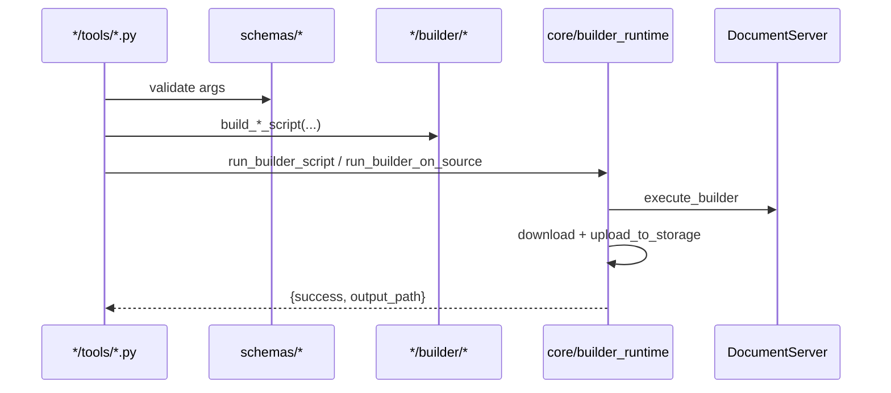
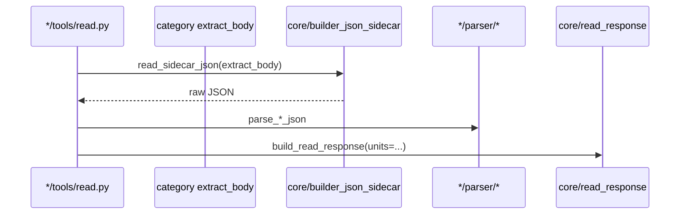
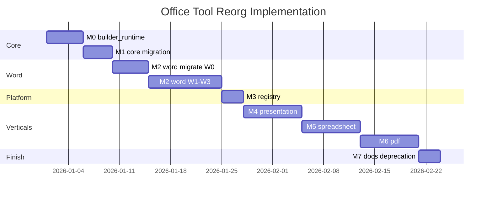

# Office Tool Implementation Design

基于 [OFFICE_TOOL_ARCHITECTURE_REORG.md](./OFFICE_TOOL_ARCHITECTURE_REORG.md) 的**完整实现设计**：将 Office MCP 从扁平六工具结构，迁移为 **core + 四类垂直模块 + legacy/gateway + registry** 的可执行工程方案。

> **状态**：Implementation design（待开发）  
> **读者**：实现工程师、Reviewers、E2E 维护者  
> **规格来源**：架构重组文档 + 四类 vertical upgrade / LLM guide

---

## 1. 文档关系

| 文档 | 用途 |
|------|------|
| [OFFICE_TOOL_ARCHITECTURE_REORG.md](./OFFICE_TOOL_ARCHITECTURE_REORG.md) | **Why / What**：架构分析、目录树、决策 |
| **本文档（implementation_design.md）** | **How**：模块 API、迁移步骤、验收标准、任务分解 |
| [**OFFICE_TOOL_IMPLEMENTATION_TASKS_BY_FILE.md**](./OFFICE_TOOL_IMPLEMENTATION_TASKS_BY_FILE.md) | **按文件必选任务**（OT-001～OT-141、OT-045c）：M0–M7 逐文件 checklist |
| [**AI_PROMPT_OFFICE_TOOL_IMPLEMENTATION.md**](./AI_PROMPT_OFFICE_TOOL_IMPLEMENTATION.md) | **Agent 执行序**：Bootstrap + M0–M7 Batch prompt |
| [OFFICE_MCP_*_UPGRADE.md](./OFFICE_MCP_WORD_UPGRADE.md) | 各类别工具参数、operations、Parser 细节 |
| [OFFICE_MCP_*_LLM_GUIDE.md](./OFFICE_MCP_WORD_LLM_GUIDE.md) | LLM 面向的调用示例（实现后同步 README） |

垂直规格索引：

- Word：[OFFICE_MCP_WORD_UPGRADE.md](./OFFICE_MCP_WORD_UPGRADE.md) · 实现设计：[OFFICE_MCP_WORD_IMPLEMENTATION_DESIGN.md](./OFFICE_MCP_WORD_IMPLEMENTATION_DESIGN.md)
- Presentation：[OFFICE_MCP_PRESENTATION_UPGRADE.md](./OFFICE_MCP_PRESENTATION_UPGRADE.md) · 实现设计：[OFFICE_MCP_PRESENTATION_IMPLEMENTATION_DESIGN.md](./OFFICE_MCP_PRESENTATION_IMPLEMENTATION_DESIGN.md)
- Spreadsheet：[OFFICE_MCP_SPREADSHEET_UPGRADE.md](./OFFICE_MCP_SPREADSHEET_UPGRADE.md) · 实现设计：[OFFICE_MCP_SPREADSHEET_IMPLEMENTATION_DESIGN.md](./OFFICE_MCP_SPREADSHEET_IMPLEMENTATION_DESIGN.md)
- PDF：[OFFICE_MCP_PDF_UPGRADE.md](./OFFICE_MCP_PDF_UPGRADE.md) · 实现设计：[OFFICE_MCP_PDF_IMPLEMENTATION_DESIGN.md](./OFFICE_MCP_PDF_IMPLEMENTATION_DESIGN.md)

---

## 2. 目标与成功标准

### 2.1 总目标

1. **结构**：`aiecs/tools/office_tool/` 按类别垂直切分；公共逻辑沉入 `core/`。
2. **能力**：四类文档均具备 **read / create / edit**（PDF create 分层见 §8.4）及 **merge**（PDF 为 merge_pdfs；PDF 无 apply_template，用 fill_form）。
3. **LLM 体验**：统一 read 顶层 schema（`category`, `units[]`, `unit_count`, `_locator_note`）；声明式 create/edit，默认不写 Builder JS。
4. **兼容**：Legacy 四工具 **`call_tool` 仍可用**（27 handler）；**`list_tools` 仅暴露 23 canonical**（**ADR-024**）。旧 import 路径 M1–M7 shim（**ADR-022**）。
5. **可维护**：新工具仅改 `*/tools/*.py` + `registry.py` 一行；adapter 不再手工维护列表。

### 2.2 阶段验收（Release Gates）

| Gate | 条件 |
|------|------|
| **G0（M0–M1）** | 现有 `tests/office_mcp/test_office_*.py` 全绿；无行为回归 |
| **G1（M2–M3）** | Word 迁目录 + registry **递增注册**；legacy 别名 `call_tool` 可用；**M3 时 canonical=8、handlers=12**（非终态 23/27）；E2E docx 路径全绿 |
| **G2（M4）** | Presentation 五工具 + E2E pptx/odp |
| **G3（M5）** | Spreadsheet 五工具 + E2E xlsx/ods |
| **G4（M6）** | PDF 五工具 + E2E pdf |
| **G5（M7）** | README / health `tool_count`+`canonical_count` / registry 与 [LEGACY_TOOL_MIGRATION.md](./LEGACY_TOOL_MIGRATION.md) |

### 2.3 非目标（本实现不包含）

- DocumentEditor 嵌入协作 URL
- OCR、数字签名、PDF 加密
- 修改 `aiecs/clients/documentserver_client.py` 的 API 面（除 bugfix）
- 从 `list_tools` 移除 legacy 名（**ADR-024**：M3 已隐藏；breaking PR 再移除 `call_tool`）

---

## 3. 目标代码结构（Canonical）

与架构文档 §2.2 一致；实现时**严格遵循**依赖约束（§7）。

```
aiecs/tools/office_tool/
├── registry.py
├── core/
├── gateway/
├── word/
├── presentation/
├── spreadsheet/
├── pdf/
└── legacy/
```

**禁止**：

- `core/` import 任何 `word|presentation|spreadsheet|pdf`
- 类别模块互相 import
- 在 `office_tool_adapter.py` 硬编码工具列表（M3 后）

---

## 4. Core 层实现规格

### 4.1 `core/categories.py`

**来源**：`conversion_output.py` 迁入并扩展。

```python
DocumentCategory = Literal["word", "presentation", "spreadsheet", "pdf", "unknown"]

WORD_EXTENSIONS: frozenset[str]
PRESENTATION_EXTENSIONS: frozenset[str]
SPREADSHEET_EXTENSIONS: frozenset[str]
PDF_EXTENSIONS: frozenset[str]

def classify_file_ext(ext: str) -> DocumentCategory: ...
def llm_coarse_output_type(ext: str) -> str: ...      # 原 llm_output_type
def builder_file_ext(output_path: str) -> str: ...    # 从 path 取 ext，供 SaveFile
def assert_category_path(category: DocumentCategory, path: str) -> str | None: ...
    """Return error message if mismatch, else None."""
```

**Shim（M1）**：`conversion_output.py`  re-export 全部 public API，标记 `# deprecated: use core.categories`。

**测试**：`tests/office_mcp/core/test_categories.py` —— 覆盖 docx/pptx/xlsx/pdf/unknown。

### 4.2 `core/builder_js.py`

```python
def escape_js(s: str) -> str: ...
def open_file(url: str, ext: str) -> str: ...       # builder.OpenFile("...", "ext");
def save_file(ext: str, filename: str) -> str: ...
def close_file() -> str: ...
def wrap_script(body: str) -> str: ...              # 可选：仅 body 时补 CloseFile
```

**迁移**：删除 `edit_document.py`、`merge_document.py`、`apply_template.py` 内重复 `_escape_js`（M0 后随 word 迁移一并清理）。

### 4.3 `core/builder_runtime.py`

统一 Builder 执行管线（当前散落在 6+ 文件）。

```python
async def run_builder_script(
    script: str,
    *,
    output_path: str | None = None,
    client: DocumentServerClient | None = None,
) -> dict:
    """
    1. script_to_url(script)
    2. client.execute_builder(url=...)
    3. 若 output_path: download fileUrl → upload_to_storage
    返回: {success, file_url?} | {success, output_path?} | {isError, text}
    """

async def run_builder_on_source(
    fetch_url: str,
    file_ext: str,
    edit_script_body: str,
    output_path: str,
    *,
    backup_source_path: str | None = None,
    client: DocumentServerClient | None = None,
) -> dict:
    """
    注入 OpenFile / SaveFile / CloseFile（用 builder_js）
    可选 backup（storage.copy_storage_file）
    → run_builder_script(full_script, output_path=...)
    """
```

**M0 任务**：

1. 实现上述两函数
2. 改 `edit_document.py` 调用 `run_builder_on_source`（行为等价）
3. 改 `merge_document.py`、`apply_template.py`、`execute_builder.py` 调用 `run_builder_script`
4. 新增 `tests/office_mcp/core/test_builder_runtime.py`（mock DS + storage）

### 4.4 `core/builder_json_sidecar.py`

用于 **word/presentation/spreadsheet/pdf** 的 fine read。

```python
SIDECAR_FILENAME = "structure.txt"

def build_sidecar_extract_script(
    open_url: str,
    file_ext: str,
    extract_body: str,
) -> str:
    """
    OpenFile → extract_body（类别提供，须将 JSON 写入变量 jsonStr）
    → CreateFile("txt") → AddText(jsonStr) → SaveFile("txt", SIDECAR_FILENAME)
    → CloseFile
    """

async def read_sidecar_json(
    source_path: str | None,
    source_url: str | None,
    file_ext: str,
    extract_body: str,
    client: DocumentServerClient | None = None,
) -> tuple[dict | None, str | None]:
    """
    resolve_document_source → build script → run_builder_script (无 output_path)
    → download sidecar from fileUrl → json.loads
    返回 (parsed, error_text)
    """
```

**注意**：`run_builder_script` 在无 `output_path` 时返回 `file_url`；sidecar 流程下载该 URL 文本内容。

### 4.5 `core/coarse_read.py`

封装 legacy Conversion 粗读，供 `legacy/read_document.py` 与各 `office_read_{category}` 的 `read_mode=coarse` 复用。

```python
async def convert_and_fetch(
    fetch_url: str,
    file_ext: str,
    output_type: str,
    client: DocumentServerClient | None = None,
) -> tuple[str | None, str | None]:
    """convert_until_complete + httpx get → body text"""

async def coarse_read_legacy(
    source_path, source_url, format: str, client=None,
) -> dict:
    """现有 read_document 逻辑迁入；返回 elements / text / outline"""
```

### 4.6 `core/source.py` / `core/storage/`

| 现文件 | 新路径 | 动作 |
|--------|--------|------|
| `source_resolver.py` | `core/source.py` | 移动；保留 `resolve_document_source` |
| `storage_paths.py` | `core/storage/paths.py` | 移动 |
| `storage.py` | `core/storage/backend.py` | 移动 |
| `object_fetch.py` | `core/storage/object_fetch.py` | 移动 |
| `docbuilder_script.py` | `core/docbuilder_script.py` | 移动 |

**Shim**：原路径 re-export（M1），例如：

```python
# aiecs/tools/office_tool/source_resolver.py
from aiecs.tools.office_tool.core.source import *  # noqa: F403
```

### 4.7 `core/errors.py`（M1 必做，ADR-006）

```python
def err(text: str) -> dict: ...
def ok(**kwargs) -> dict: ...
```

统一 `{isError: True, text: str}` 与 `{success: True, ...}`。

### 4.8 `core/read_response.py`（M1 必做，blocking，ADR-028）

见 §6.1；与 `errors.py` 同 M1 PR 交付。

---

## 5. Registry 与 MCP 适配

### 5.1 工具模块约定

每个 `*/tools/*.py` 导出：

```python
TOOL_DEF: dict          # MCP inputSchema + description
TOOL_NAME: str          # 如 "office_read_word"
handler = office_read_word  # async def

__all__ = ["TOOL_DEF", "TOOL_NAME", "handler", "office_read_word"]
```

Legacy 模块导出 **别名**（**不**进入 `list_tools`，**ADR-024**）：

```python
LEGACY_ALIASES: list[tuple[str, Callable, dict]]  # (name, handler, tool_def)
```

### 5.2 `registry.py`

```python
OFFICE_TOOL_MODULES: list[str] = [
    "aiecs.tools.office_tool.gateway.tools_execute_builder",  # 或分包
    "aiecs.tools.office_tool.word.tools.read",
    # ... 显式列表，避免扫描魔法
]

def collect_office_tools() -> list[dict]:
    """list_tools 暴露的 canonical 工具（终态 23；M3 起递增注册，见下表）"""

def get_handlers() -> dict[str, Callable]:
    """call_tool 路由，含 legacy（终态 27）"""

def tool_count() -> int:
    """len(collect_office_tools())；M6 起稳定为 23"""

def canonical_count() -> int:
    """与当前 milestone 的 tool_count 同值（ADR-026；M6 起稳定为 23）"""
```

**Registry 递增注册（与 M3 在 M4–M6 之前矛盾时，以本表为准）**：

| 里程碑 | `collect_office_tools()`（canonical） | `get_handlers()`（含 legacy） | 新增 canonical |
|--------|--------------------------------------|------------------------------|----------------|
| **M3** | **8** | **12** | gateway×2 + word×6 |
| M4 | 13 | 17 | +presentation×5 |
| M5 | 18 | 22 | +spreadsheet×5 |
| **M6** | **23** | **27** | +pdf×5 |

Legacy 四工具 **仅** `get_handlers()`，**不**进入 `collect_office_tools()`（**ADR-024**）。  
`test_registry.py` **按当前里程碑断言**上表两列，**勿**在 M3 写死 23/27。

**M3 实现步骤**：

1. 先将现有 6 工具注册进 registry（legacy 进 `get_handlers` only）
2. `office_tool_adapter.py` 改为 `from registry import ...`；`list_tools` **过滤 legacy**
3. 每新增 vertical 工具：模块 + `OFFICE_TOOL_MODULES` 一行 + `test_registry.py`
4. **强制**搬迁 word tests → `tests/office_mcp/word/`（**ADR-023**）
5. 全部暴露工具 `TOOL_DEF["description"]` 加 `[Category]` 前缀（**ADR-025**）
6. 发布 [LEGACY_TOOL_MIGRATION.md](./LEGACY_TOOL_MIGRATION.md) + CHANGELOG 条目（**ADR-024**）

### 5.3 `office_tool_adapter.py`（目标态）

```python
class OfficeToolAdapter:
    def list_tools(self) -> list[dict]:
        return collect_office_tools()  # 当前 milestone canonical；M6 终态 23（ADR-024）

    async def call_tool(self, name: str, arguments: dict) -> dict:
        handlers = get_handlers()  # 当前 milestone 含 legacy；M6 终态 27
        ...
```

### 5.4 Health / OpenAI

- `main_mcp.py` health：`tool_count` + **`canonical_count`**（**等于当前 `len(list_tools())`**；**M6 起稳定为 23**，**ADR-026**）；可选 `registered_handler_count`（**M6 起 27**）
- **M3** 起：全部暴露工具 `description` 加 `[Word]`、`[Presentation]`、`[Spreadsheet]`、`[PDF]`、`[Gateway]`（**ADR-025**）

---

## 6. 统一 Read 响应构建

### 6.1 Helper（`core/read_response.py`，M1 blocking，ADR-028）

```python
def build_read_response(
    *,
    category: DocumentCategory,
    title: str,
    units: list[dict],
    read_mode: str,
    locator_note: str,
    source_path: str | None = None,
    source_path_format: str | None = None,
    word_count: int | None = None,
    extra: dict | None = None,
) -> dict:
    """
    填充 category, unit_count, units, 类别 alias（blocks/slides/sheets/pages）,
    _locator_note, _note, read_mode
    """
```

### 6.2 类别 alias 规则（与架构 §4 一致）

| category | 除 `units[]` 外必须 mirror |
|----------|------------------------------|
| word | `blocks[]` |
| presentation | `slides[]`, `slide_count` |
| spreadsheet | `sheets[]` |
| pdf | `pages[]`, `page_count` |

---

## 7. 垂直模块实现清单

下列为 **canonical 工具名**；细节见各 UPGRADE 文档。

### 7.1 Word（M2，W0–W3）

**Word 实现设计**（schema、parser 算法、Builder 映射、PR/checklist）：[OFFICE_MCP_WORD_IMPLEMENTATION_DESIGN.md](./OFFICE_MCP_WORD_IMPLEMENTATION_DESIGN.md)

| 工具 | 模块 | 依赖 | 阶段 |
|------|------|------|------|
| `office_read_word` | `word/tools/read.py` | `parser/document.py` sidecar + `parser/html.py` coarse | W1 |
| `office_create_word` | `word/tools/create.py` | `builder/create.py`（**ADR-012**：`options.add_toc` 仅文首） | W2 |
| `office_edit_word` | `word/tools/edit.py` | `builder/edit.py`, `schemas/edit_ops.py` | W2 |
| `office_merge_word` | `word/tools/merge.py` | `builder/merge.py`（**修复 output ext**） | W3 |
| `office_apply_template_word` | `word/tools/template.py` | `builder/template.py` | W3 |
| `office_edit_word_script` | `word/tools/edit_script.py` | `run_builder_on_source` | W3 |

**Legacy**：`office_edit_document` → edit_script；`office_merge_documents` → merge_word；`office_apply_template` → apply_template_word。

**W0 文件迁移**（无行为变更）：

1. 创建 `word/` 目录树
2. 移动 `html_parser.py` → `word/parser/html.py`
3. 移动 merge/template/edit 脚本生成 → `word/builder/*`
4. 移动 tool 面 → `word/tools/*`
5. `legacy/*` 薄 re-export
6. 全量 pytest

### 7.2 Presentation（M4）

**Presentation 实现设计**（schema、SlidesToJSON sidecar、Builder 映射、PR/checklist）：[OFFICE_MCP_PRESENTATION_IMPLEMENTATION_DESIGN.md](./OFFICE_MCP_PRESENTATION_IMPLEMENTATION_DESIGN.md)

| 工具 | Parser / Builder |
|------|------------------|
| `office_read_presentation` | `parser/slides.py` + sidecar；fine read 返回 **`layouts[]`**（**ADR-016** 枚举源） |
| `office_create_presentation` | `builder/create.py` + `schemas/slide_spec.py`；`layout` 须精确匹配 `layouts[]` |
| `office_edit_presentation` | `builder/edit.py` + `schemas/edit_ops.py` |
| `office_merge_presentations` | `builder/merge.py` |
| `office_apply_template_presentation` | `builder/template.py` |

规格：[OFFICE_MCP_PRESENTATION_UPGRADE.md](./OFFICE_MCP_PRESENTATION_UPGRADE.md)

### 7.3 Spreadsheet（M5）

**Spreadsheet 实现设计**（schema、sidecar 脚本、Builder 映射、PR/checklist）：[OFFICE_MCP_SPREADSHEET_IMPLEMENTATION_DESIGN.md](./OFFICE_MCP_SPREADSHEET_IMPLEMENTATION_DESIGN.md)

| 工具 | Parser / Builder |
|------|------------------|
| `office_read_spreadsheet` | `parser/csv.py` coarse + `parser/workbook.py` fine（sidecar：**ADR-013** `GetSheetsCount()` + for） |
| `office_create_spreadsheet` | `builder/create.py` + `workbook_spec.py` |
| `office_edit_spreadsheet` | `builder/edit.py` + `edit_ops.py`（**ADR-015**：schema 弃用 `row`/`col`，主推 `cell`/`range`） |
| `office_merge_spreadsheets` | `builder/merge.py` |
| `office_apply_template_spreadsheet` | `builder/template.py`（**ADR-014**：显式地址 + `{{key}}` used_range 辅助） |

规格：[OFFICE_MCP_SPREADSHEET_UPGRADE.md](./OFFICE_MCP_SPREADSHEET_UPGRADE.md)

### 7.4 PDF（M6）

**PDF 实现设计**（schema、pages_txt 分页、Builder 双 engine、fill_form、PR/checklist）：[OFFICE_MCP_PDF_IMPLEMENTATION_DESIGN.md](./OFFICE_MCP_PDF_IMPLEMENTATION_DESIGN.md)

| 工具 | 说明 |
|------|------|
| `office_read_pdf` | `pages_txt.py`（ADR-020：`\f` → `--- page N ---` → 单页 + `_note`）+ `document.py` sidecar |
| `office_create_pdf` | `native` / `via_docx` 双模式（**ADR-017**：不自动 fallback，失败即 `{isError}`） |
| `office_edit_pdf` | 有限 operations |
| `office_merge_pdfs` | 默认 Builder；**ADR-018**：`options.engine=conversion` 显式 Conversion 路径 |
| `office_fill_pdf_form` | AcroForm 逐字段 SetValue（**ADR-019**）；**无** apply_template_pdf |

规格：[OFFICE_MCP_PDF_UPGRADE.md](./OFFICE_MCP_PDF_UPGRADE.md)

### 7.5 Gateway

| 工具 | 路径 | 里程碑 |
|------|------|--------|
| `office_execute_builder` | `gateway/execute_builder.py` | **M0** 可选物理迁目录 + 根 shim；**M3** registry 注册 |
| `office_call_api` | `gateway/call_api.py` | 同上 |

与 [OFFICE_TOOL_IMPLEMENTATION_TASKS_BY_FILE.md](./OFFICE_TOOL_IMPLEMENTATION_TASKS_BY_FILE.md) OT-019（M0 runtime）、OT-070/071（M3 迁目录 + registry）一致。

### 7.6 Legacy

| 工具 | 实现 |
|------|------|
| `office_read_document` | `legacy/read_document.py` → `core/coarse_read.coarse_read_legacy`（**行为冻结**） |
| 其他三 legacy | 转发至 word/tools 对应 handler |

---

## 8. 关键技术路径

### 8.1 写路径（Create / Edit / Merge / Template）



**所有类别共用**；差异仅在 `builder/*.py` 的 JS 生成与 `schemas/*` 校验。

### 8.2 读路径（Fine）



### 8.3 读路径（Coarse）

```
resolve_document_source → convert_and_fetch(llm_coarse_output_type)
→ category parser (html/csv/txt/pages_txt)
→ build_read_response(read_mode=coarse)
```

### 8.4 PDF 创建分层

| 场景 | 路径 |
|------|------|
| 简单页/段落/表 | `office_create_pdf`（`create_mode=native`；**失败不自动回退**，须显式 `create_mode=via_docx` 重试，**ADR-017**） |
| 长报告 / 复杂排版 | `office_create_word` → `office_call_api` convert |
| 演示稿 PDF | `office_create_presentation` → convert |

实现时在 `office_create_pdf` 返回 `_note` 指向 word convert 路径。

---

## 9. 分阶段实施计划（详细任务）

### M0 — Core runtime（1–2 PR）

- [ ] 新增 `core/builder_js.py`
- [ ] 新增 `core/builder_runtime.py`
- [ ] 重构 `edit_document.py`、`execute_builder.py`、`merge_document.py`、`apply_template.py` 使用 runtime
- [ ] `tests/office_mcp/core/test_builder_runtime.py`
- [ ] **Verify**：`poetry run pytest tests/office_mcp/test_office_*.py -v`

### M1 — Core 迁移 + shims（1 PR，blocking）

- [ ] `core/categories.py` ← `conversion_output.py`
- [ ] 移动 storage / source / docbuilder_script
- [ ] 新增 `core/coarse_read.py`（从 `read_document.py` 抽 Conversion 逻辑）
- [ ] 新增 **`core/read_response.py`**（**ADR-028**，与 errors 同 PR）
- [ ] 根目录 shim 文件 re-export
- [ ] 新增 `core/errors.py`（**ADR-006**）
- [ ] `tests/office_mcp/core/test_categories.py`, `test_storage.py`, `test_read_response.py`
- [ ] **`pyproject.toml` 注册 `word` marker**（OT-045c；M2 `@pytest.mark.word` 前置，**strict-markers**）
- [ ] **Verify**：全量 unit tests 绿

### M2 — Word 垂直 + W1–W3（2–3 PR）

- [ ] W0：目录迁移 + legacy（§7.1）
- [ ] W1：`office_read_word` + `parser/document.py` + E2E
- [ ] W2：`office_create_word`, `office_edit_word` + schemas
- [ ] W3：`office_merge_word`（SaveFile ext 修复）, template, edit_script, legacy 别名
- [ ] `tests/office_mcp/word/*`

### M3 — Registry（1 PR）

- [ ] 实现 `registry.py`（**递增注册**；M3 时 list **8** / handlers **12**，**ADR-024**）
- [ ] 瘦身 `office_tool_adapter.py`
- [ ] gateway 迁入 `gateway/` 并注册（若 M0 未迁目录）
- [ ] **搬迁** word tests → `tests/office_mcp/word/`（**ADR-023**）
- [ ] 已注册工具的 `description` 加 `[Word]` / `[Gateway]` 前缀（**ADR-025**；presentation 等随 M4+ 追加）
- [ ] health：`tool_count` + `canonical_count`（**当前 milestone 值**）；可选 `registered_handler_count`
- [ ] 发布 [LEGACY_TOOL_MIGRATION.md](./LEGACY_TOOL_MIGRATION.md) + CHANGELOG（legacy 自 list 隐藏，**非**「总数变 23」）
- [ ] `tests/office_mcp/test_registry.py`（**按里程碑断言**，见 §5.2 表）
- [ ] `tests/office_mcp/conftest.py` + `probe_ds_capabilities.py` **骨架**（e2e skip + 探针占位，**ADR-021**）
- [ ] `tests/office_mcp/test_integration.py` 更新 tool 列表断言
- [ ] **OT-138 子集**：`test_office_tool_adapter` / `test_openai_format` / `test_fastmcp_integration` 断言 **M3=8** canonical
- [ ] **ADR-029**：自 M3 合并起 **core/ 严格 freeze**（仅 bugfix）

### M4 — Presentation（1–2 PR）

- [ ] `presentation/` 全树
- [ ] 五工具 + registry 注册
- [ ] **`pyproject.toml` 注册 `presentation` marker**（OT-092）
- [ ] `tests/office_mcp/presentation/*` + E2E
- [ ] **OT-138 子集**：集成测试断言 **M4=13** canonical

### M5 — Spreadsheet（1–2 PR）

- [ ] `spreadsheet/` 全树
- [ ] 五工具 + E2E xlsx/ods
- [ ] **`pyproject.toml` 注册 `spreadsheet` marker**（OT-107）
- [ ] **OT-138 子集**：集成测试断言 **M5=18** canonical

### M6 — PDF（1–2 PR）

- [ ] `pdf/` 全树（含 `fill_form`，无 template 工具）
- [ ] 五工具 + E2E pdf
- [ ] **`pyproject.toml` 注册 `pdf` marker**（OT-123）
- [ ] **OT-138 子集**：集成测试断言 **M6 终态 23** canonical
- [ ] DS 版本探测：CI skip native E2E（**ADR-021**）；runtime **不** auto fallback create（**ADR-017**）
- [ ] `office_merge_pdfs`：Builder 默认 + `options.engine=conversion`（**ADR-018**）
- [ ] `office_fill_pdf_form`：逐字段 SetValue only（**ADR-019**）

### M7 — 文档与收尾（1 PR）

- [ ] 更新 `README.md`、 `Plan.md`
- [ ] Legacy：`call_tool` 仍可用；description **不**出现在 `list_tools`（**无** `[Legacy]` 前缀，**ADR-025**）；迁移说明见 [LEGACY_TOOL_MIGRATION.md](./LEGACY_TOOL_MIGRATION.md)
- [ ] health / OpenAI tools 与 registry 一致（**M6 终态** canonical=23 / handlers=27）
- [ ] **OT-132**：复核 `pyproject.toml` 四类 category markers 齐全（M1/M4/M5/M6 已逐 milestone 注册）
- [ ] 可选：删除 shim 文件（**ADR-022**：**不在 M7 删除**；仅单独 breaking PR）

---

## 10. 测试策略

### 10.1 目录结构

```
tests/office_mcp/
├── core/
├── gateway/
├── legacy/
├── word/
├── presentation/
├── spreadsheet/
├── pdf/
├── test_registry.py
├── test_office_tool_adapter.py
├── test_integration.py
└── test_e2e_office_tools.py          # 逐步拆到各类别 test_e2e_*
```

### 10.2 Markers

仓库 `pyproject.toml` 启用 **`--strict-markers`**；category marker **须在使用前注册**（按 milestone 递增，勿等到 M7 一次性追加）：

| 里程碑 | 注册 marker | 关联 Task |
|--------|-------------|-----------|
| **M1** | `word` | OT-045c |
| M4 | `presentation` | OT-092 |
| M5 | `spreadsheet` | OT-107 |
| M6 | `pdf` | OT-123 |
| M7 | 四类齐全复核 + README | OT-132 |

`e2e` marker 已存在于 `pyproject.toml`；M2+ E2E 可组合 `-m "word and e2e"` 等。

```ini
# pyproject.toml（终态；逐 milestone 追加）
markers =
    e2e: DocumentServer E2E
    word: word category tools
    presentation: presentation category tools
    spreadsheet: spreadsheet category tools
    pdf: pdf category tools
```

**E2E 与 DS 探针（ADR-021）**：

- `DOCUMENTSERVER_URL` 未设或 session 探针不可达 → **整包** `-m e2e` **skip**（不 fail）；`-m "not e2e"` 仍须全绿。
- 有 DS：`tests/office_mcp/probe_ds_capabilities.py`（或 session fixture）缓存能力；Sheet fine / PDF native 等按能力 skip 子集。

### 10.3 每工具最低测试

| 层级 | 内容 |
|------|------|
| Unit | mock `run_builder_script` / `read_sidecar_json` / `convert_and_fetch` |
| Schema | 非法 operations / 缺字段 / category 与 path 不匹配 |
| Parser | fixture JSON/HTML/CSV → expected units |
| E2E | 每类别至少：create → read → edit → read 验证 |

### 10.4 回归清单（每 PR）

```bash
poetry run pytest tests/office_mcp/ -v -m "not e2e"
# CI 有 DS 时（无 DS 时整包 e2e skip，ADR-021）：
DOCUMENTSERVER_URL=... DOCUMENTSERVER_JWT_SECRET=... \
  poetry run pytest tests/office_mcp/ -v -m e2e
```

---

## 11. Import 与向后兼容

### 11.1 过渡期 Shim 表

| 旧 import | 新 import | 移除时机 |
|-----------|-----------|----------|
| `aiecs.tools.office_tool.conversion_output` | `core.categories` | **ADR-022**：M7 仍保留；单独 breaking PR |
| `aiecs.tools.office_tool.html_parser` | `word.parser.html` | 同上 |
| `aiecs.tools.office_tool.edit_document` | `word.tools.edit_script` | 保留 legacy 名 |

### 11.2 `office_read_document` 行为冻结

**不得**在 M2–M6 将 `office_read_document` 透明改为调用 `office_read_{category}` fine read。

| category | Conversion | structured 字段 |
|----------|------------|-----------------|
| word | html | `elements[]` |
| presentation | txt | `elements[]` |
| spreadsheet | csv | `elements[]` |
| pdf | txt | `elements[]` |

仅在 [LEGACY_TOOL_MIGRATION.md](./LEGACY_TOOL_MIGRATION.md) 与 CHANGELOG 中说明 legacy `call_tool` 过渡；**不**在 `list_tools` 暴露 legacy。

### 11.3 Legacy MCP 工具迁移

完整对照与示例见 **[LEGACY_TOOL_MIGRATION.md](./LEGACY_TOOL_MIGRATION.md)**（**ADR-024**，M3 发布）。

---

## 12. 完整工具注册表（目标态）

| # | Tool name | Handler 模块 | Category |
|---|-----------|----------------|----------|
| 1 | `office_execute_builder` | gateway | gateway |
| 2 | `office_call_api` | gateway | gateway |
| 3 | `office_read_word` | word/tools/read | word |
| 4 | `office_create_word` | word/tools/create | word |
| 5 | `office_edit_word` | word/tools/edit | word |
| 6 | `office_merge_word` | word/tools/merge | word |
| 7 | `office_apply_template_word` | word/tools/template | word |
| 8 | `office_edit_word_script` | word/tools/edit_script | word |
| 9 | `office_read_presentation` | presentation/tools/read | presentation |
| 10 | `office_create_presentation` | presentation/tools/create | presentation |
| 11 | `office_edit_presentation` | presentation/tools/edit | presentation |
| 12 | `office_merge_presentations` | presentation/tools/merge | presentation |
| 13 | `office_apply_template_presentation` | presentation/tools/template | presentation |
| 14 | `office_read_spreadsheet` | spreadsheet/tools/read | spreadsheet |
| 15 | `office_create_spreadsheet` | spreadsheet/tools/create | spreadsheet |
| 16 | `office_edit_spreadsheet` | spreadsheet/tools/edit | spreadsheet |
| 17 | `office_merge_spreadsheets` | spreadsheet/tools/merge | spreadsheet |
| 18 | `office_apply_template_spreadsheet` | spreadsheet/tools/template | spreadsheet |
| 19 | `office_read_pdf` | pdf/tools/read | pdf |
| 20 | `office_create_pdf` | pdf/tools/create | pdf |
| 21 | `office_edit_pdf` | pdf/tools/edit | pdf |
| 22 | `office_merge_pdfs` | pdf/tools/merge | pdf |
| 23 | `office_fill_pdf_form` | pdf/tools/fill_form | pdf |
| 24 | `office_read_document` | legacy | legacy |
| 25 | `office_edit_document` | legacy → edit_script | legacy |
| 26 | `office_merge_documents` | legacy → merge_word | legacy |
| 27 | `office_apply_template` | legacy → template_word | legacy |

**Canonical 新工具**：23；**Legacy handler**（仅 call_tool）：4；**Gateway**：2。  
**`list_tools` 暴露**：23（**ADR-024**）。**`get_handlers` 注册**：27。

---

## 13. 风险与缓解

| 风险 | 缓解 |
|------|------|
| Big-bang 迁移失败 | M0→M1→M2 分 PR；每 PR 可发布 |
| Shim 遗漏导致 import 失败 | M1 全 repo grep 旧路径；CI import smoke |
| Sidecar JSON 过大 | `max_rows` / `slide_range` / `page_range` |
| DS 版本差异（PDF native） | E2E 探针 skip；runtime 失败 `{isError}` + 提示显式 `create_mode=via_docx`（**ADR-017**） |
| CI 无 DocumentServer | 整包 e2e skip，unit 仍绿（**ADR-021**） |
| Presentation layout（odp） | fine read 返回 `layouts[]`；E2E odp layout 枚举表（**ADR-016**） |
| Sheet GetSheetsCount 不可用 | fine read E2E skip；coarse 保留（**ADR-013**） |
| registry 漏注册 | `test_registry.py` **按里程碑**断言（§5.2 表）；M6 终态 23 / 27 |
| Legacy 集成断裂 | [LEGACY_TOOL_MIGRATION.md](./LEGACY_TOOL_MIGRATION.md)；call_tool 仍 27 |
| M4–M6 core 冲突 | **严格 freeze**（ADR-029）；core 增强先单独 PR |
| LLM 混用 coarse index | 统一 `_locator_note`；LLM guides |

---

## 14. 配置与环境（无变更）

现有 env 继续有效：

| 变量 | 用途 |
|------|------|
| `DOCUMENTSERVER_URL` / `DOCUMENTSERVER_JWT_SECRET` | DS 客户端 |
| `MCP_PUBLIC_URL` / `DOCBUILDER_SCRIPT_*` | script_to_url |
| `GOOGLE_APPLICATION_CREDENTIALS` / MinIO | storage |
| E2E：`E2E_GCS_*`, `E2E_MCP_URL` | 见 `test_e2e_office_tools.py` |

---

## 15. 实现顺序建议（单人/小团队）



**并行**：M4/M5/M6 可在 M3 完成后由不同开发者并行，但均依赖 M0–M1；**core/ 严格 freeze**（**ADR-029**），新 core 需求须先单独 PR。

---

## 16. 附录 A：单 PR Checklist 模板

```markdown
## PR: [M?] 简短标题

### Scope
- [ ] 文件仅与本阶段相关

### Code
- [ ] core 未 import vertical 模块
- [ ] 新工具已加入 registry（若适用）
- [ ] legacy 行为未 silent 变更

### Tests
- [ ] unit tests 新增/更新
- [ ] pytest -m "not e2e" 绿
- [ ] E2E（若适用）绿

### Docs
- [ ] UPGRADE 文档「实现状态」表更新（若该类别完成）
```

---

## 17. 附录 B：与架构文档差异说明

| 项 | 架构文档 | 本实现设计 |
|----|----------|------------|
| `core/errors.py` | 可选 | **M1 必做**（ADR-006） |
| `core/read_response.py` | §4 提及 | **M1 blocking**（ADR-028） |
| pdf/tools/create.py | 目录树未列 create tool 文件 | 补充 `pdf/tools/create.py` |
| registry | 概念 | §5 模块约定 + **递增**注册（M3 8/12 → M6 **23/27** 终态） |
| gateway 迁目录 | M0 即可 | **M3** registry 注册（§7.5；与 tasks OT-070/071 一致） |
| Core API 签名 | 概念级 | **§4.1 可执行真源**（架构文档 §3 已标注） |
| ADR-012～020 | 分散于 UPGRADE | 已回写本文档 §7–§8、§13 与各 vertical 规格 |
| ADR-021～022 | CI 探针 / shim | 已回写 §10.2、§11.1、§13；shim M7 保留 |
| pytest category markers | M7 一次性追加 | **逐 milestone**（M1 word → M4–M6 其余；**strict-markers**） |
| ADR-023～030 | registry / tests / PDF | 已回写 §5、§6、§10、§11、§13；[LEGACY_TOOL_MIGRATION.md](./LEGACY_TOOL_MIGRATION.md) |

---

## 18. 下一步

1. **Review** 本文档 + §12 工具表与各 UPGRADE 文档一致性。  
2. **Agent 执行**：按 [AI_PROMPT_OFFICE_TOOL_IMPLEMENTATION.md](./AI_PROMPT_OFFICE_TOOL_IMPLEMENTATION.md) Bootstrap → M0–M7 Batch 顺序推进（**勿**以 `docs/archive/` 为真源）。  
3. **执行** [OFFICE_TOOL_IMPLEMENTATION_TASKS_BY_FILE.md](./OFFICE_TOOL_IMPLEMENTATION_TASKS_BY_FILE.md)（OT-013 起 **M0**）。  
4. M0 PR 合并后按 §9 / tasks 文档顺序推进；每阶段满足 §2.2 Release Gate。
